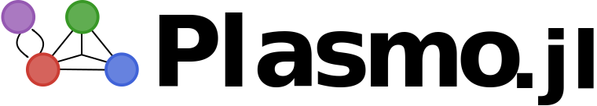

[](https://travis-ci.org/jalving/Plasmo.jl)
[](https://codecov.io/gh/jalving/Plasmo.jl)
[](https://jalving.github.io/Plasmo.jl/dev/)

# Plasmo.jl
Plasmo.jl (Platform for Scalable Modeling and Optimization) is modeling interface that facilitates solving optimization problems using a graph-based approach.  The package enables component style modeling by means of modularizing optimization models that
can be constructed independently and connected using linking constraints.    
The graph-based modeling approach facilitates decomposition techniques such as graph partitioning and community detection which enable the use of parallel solvers such as [PIPS-NLP](https://github.com/Argonne-National-Laboratory/PIPS/tree/master/PIPS-NLP),[DSP](https://github.com/Argonne-National-Laboratory/DSP), or built-in Julia solvers for Benders
and Lagrangean Decomposition.
Plasmo.jl has been developed by the [Scalable Systems Laboratory](http://zavalab.engr.wisc.edu/) at the University of Wisconsin-Madison.


## Documentation
Documentation is available through [GitHub Pages](https://jalving.github.io/Plasmo.jl/dev).
Additional examples can be found in the [examples](https://github.com/jalving/Plasmo.jl/tree/master/examples/ModelGraph) folder.

## Installation

```julia
Pkg.clone("https://github.com/jalving/Plasmo.jl")
```

## Simple Example

Plasmo.jl uses optimization models written with [JuMP](https://github.com/JuliaOpt/JuMP.jl).

```julia
using JuMP
using Plasmo
using Ipopt

graph = ModelGraph()
setsolver(graph,IpoptSolver())

#Add nodes to a ModelGraph
n1 = add_node!(graph)
n2 = add_node!(graph)

#Create JuMP models
m1 = Model()
@variable(m1,0 <= x <= 2)
@variable(m1,0 <= y <= 3)
@constraint(m1,x+y <= 4)
@objective(m1,Min,x)

m2 = Model()
@variable(m2,x)
@NLconstraint(m2,exp(x) >= 2)

#Set JuMP models on nodes
setmodel(n1,m1)     #set m1 to node 1.  Updates reference on m1
setmodel(n2,m2)

#Link constraints take the same expressions as the JuMP @constraint macro
@linkconstraint(graph,n1[:x] == n2[:x])

#Get all of the link constraints in a graph
links = getlinkconstraints(graph)

solve(graph)

println("n1[:x]= ",JuMP.getvalue(n1[:x]))
println("n2[:x]= ",JuMP.getvalue(n2[:x]))
```

## Acknowledgments
This code is based on work supported by the U.S. Department of Energy (DOE), Office of Science, under Contract No. DE-AC02-06CH11357 as well as the DOE Office of Electricity Delivery and Energy Reliability’s Advanced Grid Research and Development program at Argonne National Laboratory.

## Citing Plasmo
If you find Plasmo useful for your work, you might cite the current [pre-print](https://arxiv.org/pdf/1812.04983.pdf) of the manuscript:

    @article{JalvingZavala2018,
    archivePrefix = {arXiv},
    arxivId = {arXiv:1812.04983v1},
    author = {Jalving, Jordan and Cao, Yankai and Zavala, Victor M},
    eprint = {arXiv:1812.04983v1},
    title = {{Graph-Based Modeling and Simulation of Complex Systems}}
    }
