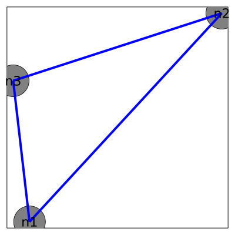
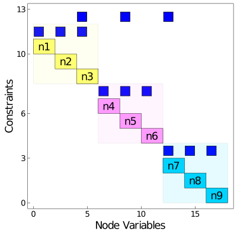

# Modeling with OptiGraphs
The primary modeling object in Plasmo.jl is the [`OptiGraph`](@ref). An optigraph is composed of [`OptiNode`](@ref)s (which represent self-contained optimization problems) which are connected by [`OptiEdge`](@ref)s
(which encapsulate [`LinkConstraint`](@ref)s that couple optinodes). The optigraph provides a modular approach to create optimization problems and provides
graph functions which can be used to manage model development, reveal inherent structures, and perform graph processing tasks such as partitioning.

The optigraph ultimately describes the following mathematical representation of an optimization problem:
```math
\begin{aligned}
    \min_{{\{x_n}\}_{n \in \mathcal{N}(\mathcal{G})}} & \quad \sum_{n \in \mathcal{N(\mathcal{G})}} f_n(x_n) \quad & (\textrm{Objective}) \\
    \textrm{s.t.} & \quad x_n \in \mathcal{X}_n,      \quad n \in \mathcal{N(\mathcal{G})}, \quad & (\textrm{Node Constraints})\\
    & \quad g_e(\{x_n\}_{n \in \mathcal{N}(e)}) = 0,  \quad e \in \mathcal{E(\mathcal{G})}. &(\textrm{Link Constraints})
\end{aligned}
```
In this formulation, ``\mathcal{G}`` represents the optigraph, ``{\{x_n}\}_{n \in \mathcal{N}(\mathcal{G})}`` describes a collection of decision
variables over the set of nodes (optinodes) ``\mathcal{N}(\mathcal{G})``, and ``x_n`` is the set of
decision variables on node ``n``. The objective function for the optigraph ``\mathcal{G}`` is given by a linear combination of objective functions on each optinode ``f_n(x_n)``.
The second equation represents constraints on each optinode ``\mathcal{N}(\mathcal{G})``, and the third equation represents the collection of
linking constraints associated with optiedges ``\mathcal{E}(\mathcal{G})``. The constraints of an optinode ``n`` are represented by the set ``\mathcal{X}_n`` while the linking constraints
that correspond to an edge ``e`` are represented by the vector function ``g_e(\{x_n\}_{n \in \mathcal{N}(e)})``.

From an implementation standpoint, an optigraph contains optinode and optiedge objects and extends much of the modeling functionality and syntax from [JuMP](https://github.com/jump-dev/JuMP.jl).


## Creating an OptiGraph
An optigraph does not require any arguments to construct:

```@meta
CurrentModule = Plasmo
DocTestSetup = quote
    using Plasmo
end
```

```jldoctest modeling
julia> using Plasmo

julia> graph1 = OptiGraph()
      OptiGraph: # elements (including subgraphs)
-------------------------------------------------------------------
      OptiNodes:     0              (0)
      OptiEdges:     0              (0)
LinkConstraints:     0              (0)
 sub-OptiGraphs:     0              (0)
```

```@meta
DocTestSetup = nothing
```

## Adding OptiNodes
The most effective way to add optinodes to an optigraph is by using the [`@optinode`](@ref) macro.  The below snippet adds the node `n1` to
the optigraph `graph1`.

```jldoctest modeling
julia> @optinode(graph1,n1)
OptiNode w/ 0 Variable(s) and 0 Constraint(s)
```
It is also possible to create sets of optinodes with a single call to [`@optinode`](@ref) like shown in the below code snippet.
Here, we create two more optinodes which returns the reference `nodes`. This macro call produces a `JuMP.DenseAxisArray` which
allows us to refer to each optinode using the produced index sets.  For example, `nodes[2]` and `nodes[3]` each return the corresponding
optinode.

```jldoctest modeling
julia> @optinode(graph1,nodes[2:3])
1-dimensional DenseAxisArray{OptiNode,1,...} with index sets:
    Dimension 1, 2:3
And data, a 2-element Vector{OptiNode}:
 OptiNode w/ 0 Variable(s) and 0 Constraint(s)
 OptiNode w/ 0 Variable(s) and 0 Constraint(s)

julia> nodes[2]
OptiNode w/ 0 Variable(s) and 0 Constraint(s)

julia> nodes[3]
OptiNode w/ 0 Variable(s) and 0 Constraint(s)
```

Each optinode supports adding variables, constraints, and an objective function. Here we loop through each optinode in `graph1` using the [`optinodes`](@ref) function
and we construct underlying model elements.

```jldoctest modeling
julia>  for node in optinodes(graph1)
            @variable(node,x >= 0)
            @variable(node, y >= 2)
            @constraint(node, conref, x + y >= 3)
            @NLconstraint(node, nlconref, x^3 >= 1)
            @objective(node, Min, x + y)
        end
```

!!! note

     The [`OptiNode`](@ref) extends a `JuMP.AbstractModel` and supports `JuMP` macros such as `@variable`, `@constraint`, `@NLconstraint`, and `@objective`

Variables within an optinode can be accessed directly by indexing the associated symbol. This enclosed name-space is useful for
referencing variables on different optinodes when creating link-constraints or optigraph objective functions.
```jldoctest modeling
julia> n1[:x]
n1[:x]

julia> nodes[2][:x]
nodes[2][:x]
```

## Adding LinkConstraints
[`LinkConstraint`](@ref)s are linear constraints that couple variables across optinodes. The simplest way to create a link-constraint
is to use the [`@linkconstraint`](@ref) macro. This macro accepts the same input as the `@constraint` macro, but it requires variables to be on at least two different optinodes.

```jldoctest modeling
julia> @linkconstraint(graph1, linkconref, n1[:x] + nodes[2][:x] + nodes[3][:x] == 3)
linkconref: n1[:x] + nodes[2][:x] + nodes[3][:x] = 3.0
```
!!! note

    Nonlinear link-constraints are not yet supported.

## Solving and Querying Solutions

An optimizer can be specified using the [`set_optimizer`](@ref) function which supports any
[MathOptInterface.jl](https://github.com/jump-dev/MathOptInterface.jl) optimizer. For example, we could use the `Ipopt.Optimizer` from the [Ipopt.jl](https://github.com/jump-dev/Ipopt.jl) package and solve the optigraph as following:

```jldoctest modeling
julia> using Ipopt

julia> set_optimizer(graph1, Ipopt.Optimizer)

julia> set_optimizer_attribute(graph1, "print_level", 0) #suppress Ipopt output

julia> optimize!(graph1)

******************************************************************************
This program contains Ipopt, a library for large-scale nonlinear optimization.
 Ipopt is released as open source code under the Eclipse Public License (EPL).
         For more information visit https://github.com/coin-or/Ipopt
******************************************************************************
```

The solution of an optigraph is stored directly on its optinodes and optiedges. Variables values, constraint duals, objective function values, and solution status codes can be queried just like in JuMP.

```jldoctest modeling
julia> termination_status(graph1)   
LOCALLY_SOLVED::TerminationStatusCode = 4

julia> value(n1[:x])    
1.0

julia> value(nodes[2][:x])
1.0

julia> value(nodes[3][:x])
1.0

julia> round(objective_value(graph1))
9.0

julia> round(dual(linkconref), digits = 2)
-0.25

julia> round(dual(n1[:conref]), digits = 2)
0.5

julia> round(dual(n1[:nlconref]), digits = 2)
0.25
```   

## Plotting OptiGraphs
We can also plot the graph structure of `graph1` using both graph and matrix layouts from the [PlasmoPlots](https://github.com/plasmo-dev/PlasmoPlots.jl) package.


```@setup plot_example1
    using Plasmo
    graph1 = OptiGraph()
    @optinode(graph1,n1)
    @optinode(graph1,nodes[2:3])

    for node in optinodes(graph1)
        @variable(node,x >= 0)
        @variable(node, y >= 2)
        @constraint(node,x + y >= 3)
        @objective(node, Min, y)
    end

    @linkconstraint(graph1, n1[:x] + nodes[2][:x] + nodes[3][:x] == 3)
```

```julia
using PlasmoPlots

plt_graph = layout_plot(graph1,
                        node_labels=true,
                        markersize=30,
                        labelsize=15,
                        linewidth=4,
                        layout_options=Dict(:tol=>0.01,
                                            :iterations=>2),
                        plt_options=Dict(:legend=>false,
                                         :framestyle=>:box,
                                         :grid=>false,
                                         :size=>(400,400),
                                         :axis => nothing))

plt_matrix = matrix_layout(graph1, node_labels=true, markersize=15);   
```

 

!!! note

    The `layout_plot` and `matrix_plot` functions return a `Plots.plot` object which can be used for further customization and saving using `Plots.jl`

## Hierarchical Modeling using Subgraphs
Another fundamental feature of an optigraph is the ability to create subgraphs (i.e. sub-optigraphs). Subgraphs are defined using the [`add_subgraph!`](@ref) function which embeds an
optigraph as a subgraph within a higher level optigraph. This is demonstrated in the below snippets. First, we create two new optigraphs in the same fashion we did above.

```jldoctest modeling
julia> graph2 = OptiGraph();

julia> @optinode(graph2,nodes2[1:3]);

julia>  for node in optinodes(graph2)
            @variable(node, x >= 0)
            @variable(node, y >= 2)
            @constraint(node,x + y >= 5)
            @objective(node, Min, y)
        end

julia> @linkconstraint(graph2, nodes2[1][:x] + nodes2[2][:x] + nodes2[3][:x] == 5);

julia> graph3 = OptiGraph();

julia> @optinode(graph3,nodes3[1:3]);

julia>  for node in optinodes(graph3)
            @variable(node, x >= 0)
            @variable(node, y >= 2)
            @constraint(node,x + y >= 5)
            @objective(node, Min, y)
        end

julia> @linkconstraint(graph3, nodes3[1][:x] + nodes3[2][:x] + nodes3[3][:x] == 7);
```

We now have three optigraphs (`graph1`,`graph2`, and `graph3`), each with their own local optinodes and optiedges (link-constraints).  
These optigraphs can be embedded into a higher level optigraph with the following snippet:

```jldoctest modeling
julia> graph0 = OptiGraph()
      OptiGraph: # elements (including subgraphs)
-------------------------------------------------------------------
      OptiNodes:     0              (0)
      OptiEdges:     0              (0)
LinkConstraints:     0              (0)
 sub-OptiGraphs:     0              (0)

julia> add_subgraph!(graph0,graph1)
      OptiGraph: # elements (including subgraphs)
-------------------------------------------------------------------
      OptiNodes:     0              (3)
      OptiEdges:     0              (1)
LinkConstraints:     0              (1)
 sub-OptiGraphs:     1              (1)

julia> add_subgraph!(graph0,graph2)
      OptiGraph: # elements (including subgraphs)
-------------------------------------------------------------------
      OptiNodes:     0              (6)
      OptiEdges:     0              (2)
LinkConstraints:     0              (2)
 sub-OptiGraphs:     2              (2)

julia> add_subgraph!(graph0,graph3)
      OptiGraph: # elements (including subgraphs)
-------------------------------------------------------------------
      OptiNodes:     0              (9)
      OptiEdges:     0              (3)
LinkConstraints:     0              (3)
 sub-OptiGraphs:     3              (3)

```
Here, we see the distinction between local and  total elements. After we add all three subgraphs
to `graph0`, we see that it contains 0 local optinodes, but contains 9 total optinodes which are elements of its subgraphs. This hierarchical distinction is also
made for optiedges (link-constraints) and additional subgraphs. Subgraphs can be nested recursively such that an optigraph might contain
local subgraphs, and the highest level optigraph contains all of the subgraphs.

Using this hierarchical approach, link-constraints can be expressed both locally and globally. For instance, we can add a link-constraint to `graph0` that
connects optinodes across its subgraphs like following:
```jldoctest modeling
julia> @linkconstraint(graph0,nodes[3][:x] + nodes2[2][:x] + nodes3[1][:x] == 10)
: nodes[3][:x] + nodes2[2][:x] + nodes3[1][:x] = 10.0

julia> println(graph0)
      OptiGraph: # elements (including subgraphs)
-------------------------------------------------------------------
      OptiNodes:     0              (9)
      OptiEdges:     1              (4)
LinkConstraints:     1              (4)
 sub-OptiGraphs:     3              (3)
```
`graph0` now contains 1 local link-constraint, and 4 total link-constraints (3 from the subgraphs).
Here, the local link-constraint in `graph0` is a global constraint to the entire optigraph that connects each of its subgraphs.
This hierarchical construction is often useful for constructing more complex optimization problems
separately and then coupling them in a higher level optigraph.

We can lastly plot the hierarchical optigraph and see the nested subgraph structure.

```@setup plot_example2
    using Plasmo

    graph1 = OptiGraph()
    @optinode(graph1,n1)
    @optinode(graph1,nodes[2:3])

    for node in optinodes(graph1)
        @variable(node,x >= 0)
        @variable(node, y >= 2)
        @constraint(node,x + y >= 3)
        @objective(node, Min, y)
    end

    @linkconstraint(graph1, n1[:x] + nodes[2][:x] + nodes[3][:x] == 3)

    graph2 = OptiGraph();

    @optinode(graph2,nodes2[1:3]);

    for node in optinodes(graph2)
        @variable(node, x >= 0)
        @variable(node, y >= 2)
        @constraint(node,x + y >= 5)
        @objective(node, Min, y)
    end

    @linkconstraint(graph2, nodes2[1][:x] + nodes2[2][:x] + nodes2[3][:x] == 5);

    graph3 = OptiGraph();

    @optinode(graph3,nodes3[1:3]);

    for node in optinodes(graph3)
        @variable(node, x >= 0)
        @variable(node, y >= 2)
        @constraint(node,x + y >= 5)
        @objective(node, Min, y)
    end

    @linkconstraint(graph3, nodes3[1][:x] + nodes3[2][:x] + nodes3[3][:x] == 7)

    graph0 = OptiGraph()
    add_subgraph!(graph0,graph1)
    add_subgraph!(graph0,graph2)
    add_subgraph!(graph0,graph3)

    @linkconstraint(graph0,nodes[3][:x] + nodes2[2][:x] + nodes3[1][:x] == 10)
```

```julia
using PlasmoPlots

for (i,node) in enumerate(all_nodes(graph0))
    set_label(node, "n$i")
end

plt_graph0 = PlasmoPlots.layoutplot(graph0,
                                    node_labels=true,
                                    markersize=60,
                                    labelsize=30,
                                    linewidth=4,
                                    subgraph_colors=true,
                                    layout_options = Dict(:tol=>0.001,
                                                     :C=>2,
                                                     :K=>4,
                                                     :iterations=>5))

plt_matrix0 = PlasmoPlots.matrix(graph0,
                                 node_labels = true,
                                 subgraph_colors = true,
                                 markersize = 16)
```

 


## Query OptiGraph Attributes
There are many functions in Plasmo.jl used to query optigraph attributes (see the [API Documentation](@ref) for a full list). We can use [`optinodes`](@ref) to retrieve an array of
the local optinodes in an optigraph, whereas [`all_nodes`](@ref) will recursively retrieve all of the optinodes in an optigraph, including the optinodes in its subgraphs.

```jldoctest modeling
julia> optinodes(graph1)
3-element Vector{OptiNode}:
 OptiNode w/ 2 Variable(s) and 2 Constraint(s)
 OptiNode w/ 2 Variable(s) and 2 Constraint(s)
 OptiNode w/ 2 Variable(s) and 2 Constraint(s)

julia> optinodes(graph0)
OptiNode[]

julia> all_nodes(graph0)
9-element Vector{OptiNode}:
 OptiNode w/ 2 Variable(s) and 2 Constraint(s)
 OptiNode w/ 2 Variable(s) and 2 Constraint(s)
 OptiNode w/ 2 Variable(s) and 2 Constraint(s)
 OptiNode w/ 2 Variable(s) and 1 Constraint(s)
 OptiNode w/ 2 Variable(s) and 1 Constraint(s)
 OptiNode w/ 2 Variable(s) and 1 Constraint(s)
 OptiNode w/ 2 Variable(s) and 1 Constraint(s)
 OptiNode w/ 2 Variable(s) and 1 Constraint(s)
 OptiNode w/ 2 Variable(s) and 1 Constraint(s)
```

It is also possible to query for optiedges in the same way using [`optiedges`](@ref) and [`all_edges`](@ref).
```jldoctest modeling
julia> optiedges(graph1)
1-element Vector{OptiEdge}:
 OptiEdge w/ 1 Constraint(s)

julia> optiedges(graph0)
1-element Vector{OptiEdge}:
 OptiEdge w/ 1 Constraint(s)

julia> all_edges(graph0)
4-element Vector{OptiEdge}:
 OptiEdge w/ 1 Constraint(s)
 OptiEdge w/ 1 Constraint(s)
 OptiEdge w/ 1 Constraint(s)
 OptiEdge w/ 1 Constraint(s)
```

We can query link-constraints using [`linkconstraints`](@ref) and [`all_linkconstraints`](@ref).

```jldoctest modeling
julia> linkconstraints(graph1)
1-element Vector{LinkConstraintRef}:
 linkconref: n1[:x] + nodes[2][:x] + nodes[3][:x] = 3.0

julia> linkconstraints(graph0)
1-element Vector{LinkConstraintRef}:
 : nodes[3][:x] + nodes2[2][:x] + nodes3[1][:x] = 10.0

julia> all_linkconstraints(graph0)
4-element Vector{LinkConstraintRef}:
 linkconref: n1[:x] + nodes[2][:x] + nodes[3][:x] = 3.0
 : nodes2[1][:x] + nodes2[2][:x] + nodes2[3][:x] = 5.0
 : nodes3[1][:x] + nodes3[2][:x] + nodes3[3][:x] = 7.0
 : nodes[3][:x] + nodes2[2][:x] + nodes3[1][:x] = 10.0
```

We can lastly query subgraphs using [`subgraphs`](@ref) and [`all_subgraphs`](@ref)

```jldoctest modeling
julia> subgraphs(graph0)
3-element Vector{OptiGraph}:
       OptiGraph: # elements (including subgraphs)
-------------------------------------------------------------------
      OptiNodes:     3              (3)
      OptiEdges:     1              (1)
LinkConstraints:     1              (1)
 sub-OptiGraphs:     0              (0)
       OptiGraph: # elements (including subgraphs)
-------------------------------------------------------------------
      OptiNodes:     3              (3)
      OptiEdges:     1              (1)
LinkConstraints:     1              (1)
 sub-OptiGraphs:     0              (0)
       OptiGraph: # elements (including subgraphs)
-------------------------------------------------------------------
      OptiNodes:     3              (3)
      OptiEdges:     1              (1)
LinkConstraints:     1              (1)
 sub-OptiGraphs:     0              (0)
```

## Managing Multiple OptiGraphs
!!! note

    Documentation Coming Soon!
