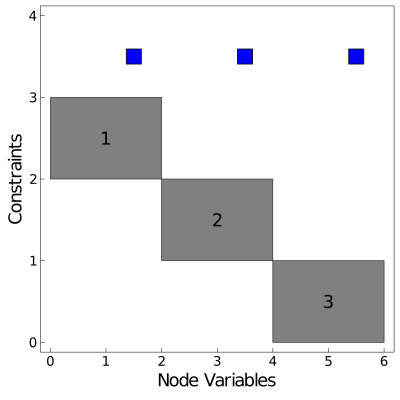

# Quickstart

This quickstart example gives a brief overview of the functions needed to effectively use Plasmo.jl to build optimization models. If you are familiar with [JuMP.jl](https://github.com/jump-dev/JuMP.jl),
much of the functionality you see here will be familiar. In fact, the primary [`OptiGraph`](@ref) and [`OptiNode`](@ref) objects from Plasmo.jl extend the `JuMP.AbstractModel` and support many JuMP functions.  

The below example demonstrates the construction of a simple linear optimization problem that contains two optinodes coupled by a simple [`LinkConstraint`](@ref) (which creates an [`OptiEdge`](@ref)) which is solved with
the [GLPK](https://github.com/jump-dev/GLPK.jl) linear optimization solver. Additional examples can be found at the [Plasmo Examples](https://github.com/plasmo-dev/PlasmoExamples) repository.

Once Plasmo.jl has been installed, you can use it from a Julia session as following:
```jldoctest quickstart_example
julia> using Plasmo
```

For this example we also need to import the GLPK optimization solver and the [PlasmoPlots](https://github.com/plasmo-dev/PlasmoPlots.jl) package which we use to visualize graph structure.
```julia
julia> using GLPK
julia> using PlasmoPlots
```

## Create an OptiGraph

The following command will create the optigraph (referred to as `graph`). We also see the printed output which denotes the number of optinodes, optiedges, link-constraints, and subgraphs (other optigraphs contained within `graph`).
```jldoctest quickstart_example
julia> graph = OptiGraph()
      OptiGraph: # elements (including subgraphs)
-------------------------------------------------------------------
      OptiNodes:     0              (0)
      OptiEdges:     0              (0)
LinkConstraints:     0              (0)
 sub-OptiGraphs:     0              (0)
```

!!! note
    An [`OptiGraph`](@ref) distinguishes between its direct elements (optinodes and optiedges contained directly within the graph) and its subgraph elements (optinodes and optiedges contained within its subgraphs). This distinction
    is used to describe hierarchical graph structures in [Hierarchical Modeling using Subgraphs](@ref).

## Add OptiNodes
An optigraph consists of [`OptiNode`](@ref)`s` which contain stand-alone optimization models. An optinode supports JuMP
macros used to create variables, constraints, expressions, and objective functions (i.e. it supports JuMP macros such as `@variable`, `@constraint`, and `@objective`). The simplest way to add optinodes to an optigraph is
to use the [`@optinode`](@ref) macro as shown in the following code snippet. For this example we create the optinode `n1`, we create two optinode variables `x` and `y`, and we add
a single constraint and an objective function.

```jldocest quickstart_example
julia> @optinode(graph, n1)
OptiNode w/ 0 Variable(s) and 0 Constraint(s)

julia> @variable(n1, y >= 2)
n1[:y]

julia> @variable(n1, x >= 0)
n1[:x]

julia> @constraint(n1, x + y >= 3)
n1[:y] + n1[:x] ≥ 3.0

julia> @objective(n1, Min, y)
n1[:y]
```

```@meta
DocTestSetup = nothing
```

```@meta
    DocTestSetup = quote
    using Plasmo
    using GLPK
    using PlasmoPlots

    graph = OptiGraph()
    @optinode(graph,n1)
    @variable(n1, y >= 2)
    @variable(n1,x >= 0)
    @constraint(n1,x + y >= 3)
    @objective(n1, Min, y)

    @optinode(graph,n2);
    @variable(n2, y >= 0);
    @variable(n2, x >= 0);
    @constraint(n2,x + y >= 3);
    @objective(n2, Min, y);

    @optinode(graph,n3);
    @variable(n3, y >= 0);
    @variable(n3,x >= 0);
    @constraint(n3,x + y >= 3);
    @objective(n3, Min, y);  
end
```

We can create more optinodes and add variables, constraints, and objective functions to each of them.
```julia
julia> @optinode(graph, n2);
julia> @variable(n2, y >= 0);
julia> @variable(n2, x >= 0);
julia> @constraint(n2, x + y >= 3);
julia> @objective(n2, Min, y);

julia> @optinode(graph, n3);
julia> @variable(n3, y >= 0);
julia> @variable(n3, x >= 0);
julia> @constraint(n3, x + y >= 3);
julia> @objective(n3, Min, y);  
```

```jldoctest quickstart_example_2
julia> println(graph)
      OptiGraph: # elements (including subgraphs)
-------------------------------------------------------------------
      OptiNodes:     3              (3)
      OptiEdges:     0              (0)
LinkConstraints:     0              (0)
 sub-OptiGraphs:     0              (0)
```

```@meta
DocTestSetup = nothing
```

## Create LinkConstraints
A [`LinkConstraint`](@ref) can be used to couple variables between optinodes. Creating a link-constraint automatically creates an
[`OptiEdge`](@ref) in the optigraph which describes the connectivity between optinodes.  Link-constraints are created using the [`@linkconstraint`](@ref) macro which takes the exact same
input as the `JuMP.@constraint` macro. The following code creates a link-constraint between variables on the three optinodes.

```jldoctest quickstart_example_2
julia> @linkconstraint(graph, n1[:x] + n2[:x] + n3[:x] == 3)
: n1[:x] + n2[:x] + n3[:x] = 3.0

julia> println(graph)
      OptiGraph: # elements (including subgraphs)
-------------------------------------------------------------------
      OptiNodes:     3              (3)
      OptiEdges:     1              (1)
LinkConstraints:     1              (1)
 sub-OptiGraphs:     0              (0)

```
!!! note
    Using the standard `@constraint` macro on an optigraph will also create a link-constraint. The `@linkconstraint` syntax is preferred to help model readability.

!!! note
    Nonlinear link-constraints are not yet supported.

## Solve the OptiGraph and Query the Solution

When using a [MathOptInterface.jl](https://github.com/jump-dev/MathOptInterface.jl) (MOI) optimization solver, we can optimize an optigraph using the [`set_optimizer`](@ref) and [`optimize!`](@ref) functions extended from JuMP.  
Plasmo.jl will translate the optigraph into an MOI optimizer to solve the model.
```jldoctest quickstart_example_2
julia> set_optimizer(graph, GLPK.Optimizer)

julia> optimize!(graph)
```

After returning from the optimizer we can query the termination status using [`termination_status`](@ref) (again just like in JuMP). We can also
query the solution of variables using [`value`](@ref) and the objective value of the graph using [`objective_value`](@ref)
```jldoctest quickstart_example_2
julia> termination_status(graph)   
OPTIMAL::TerminationStatusCode = 1

julia> value(n1[:x])    
1.0

julia> value(n2[:x])
2.0

julia> value(n3[:x])
0.0

julia> objective_value(graph)
6.0
```     

!!! note
    It is also possible to optimize individual optinodes, or even optimize different optigraphs that share the same optinode. The latest optimization result is always accessible using
    `value(variable)`. The results specific to an optinode or optigraph can be accessed with `value(node, variable)` (for optinodes) or `value(graph, variable)` (for optigraphs).

!!! note
    Plasmo.jl assumes the objective function of each optinode is added by default.  The objective function for an optigraph can be changed using the `@objective` macro
    on the optigraph itself. This will update the local objective function on each optinode.

    Nonlinear graph objective functions are not yet supported. Currently, the user must set nonlinear objective functions on each optinode which get added together.

## Visualize the Structure

```@setup plot_example
    using Plasmo
    using PlasmoPlots

    graph = OptiGraph()
    @optinode(graph,n1)
    @variable(n1, y >= 2)
    @variable(n1,x >= 0)
    @constraint(n1,x + y >= 3)
    @objective(n1, Min, y)

    @optinode(graph,n2);
    @variable(n2, y >= 0);
    @variable(n2,x >= 0);
    @constraint(n2,x + y >= 3);
    @objective(n2, Min, y);

    @optinode(graph,n3);
    @variable(n3, y >= 0);
    @variable(n3, x >= 0);
    @constraint(n3,x + y >= 3);
    @objective(n3, Min, y);  

    @linkconstraint(graph, n1[:x] + n2[:x] + n3[:x] == 3);
```

Lastly, it is often useful to visualize the structure of an optigraph. The visualization can lead to insights about an optimization problem and understand its connectivity. Plasmo.jl uses [PlasmoPlots.jl](https://github.com/plasmo-dev/PlasmoPlots.jl) (which builds on [Plots.jl](https://github.com/JuliaPlots/Plots.jl) and [NetworkLayout.jl](https://github.com/JuliaGraphs/NetworkLayout.jl)) to visualize the layout of an optigraph. The code here shows how to obtain the graph topology using [`PlasmoPlots.layout_plot`](@ref) and we plot the corresponding incidence matrix structure using [`PlasmoPlots.matrix_plot`](@ref). Both of these functions can accept keyword arguments to customize their layout or appearance.
The matrix visualization also encodes information on the number of variables and constraints in each optinode and optiedge. The left figure shows a standard graph visualization where we draw an edge between each pair of nodes
if they share an edge, and the right figure shows the matrix representation where labeled blocks correspond to nodes and blue marks represent linking constraints that connect their variables. The node layout helps visualize the overall connectivity of the graph while the matrix layout helps visualize the size of nodes and edges.

```julia
plt_graph = PlasmoPlots.layout_plot(graph,
            node_labels=true, markersize=30, labelsize=15, linewidth=4,
            layout_options=Dict(:tol=>0.01, :iterations=>2),
            plt_options=Dict(:legend=>false, :framestyle=>:box, :grid=>false,
            :size=>(400,400), :axis=>nothing))

plt_matrix = PlasmoPlots.matrix_plot(graph, node_labels=true, markersize=15)   
```

 
