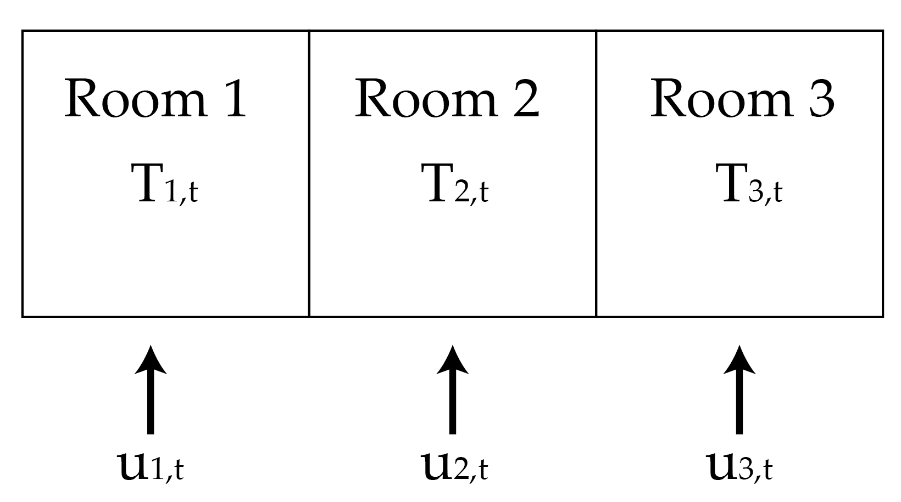
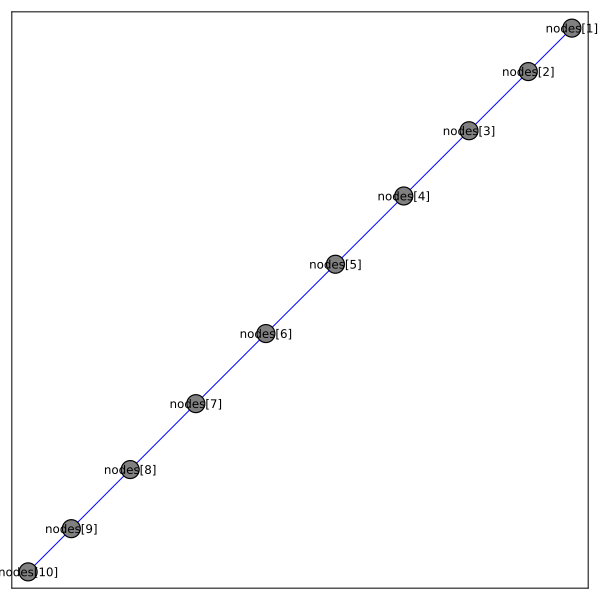
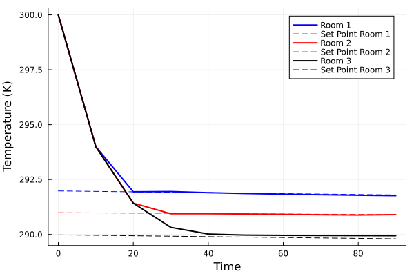
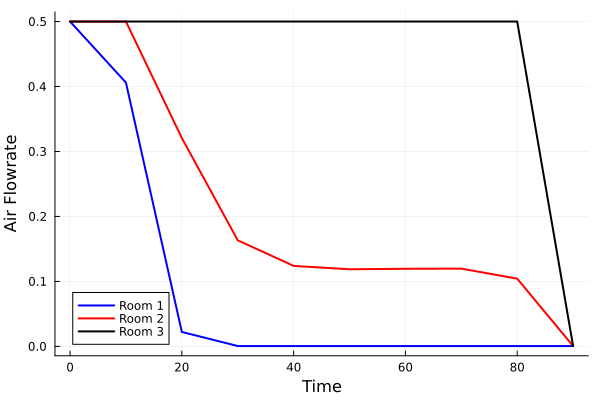
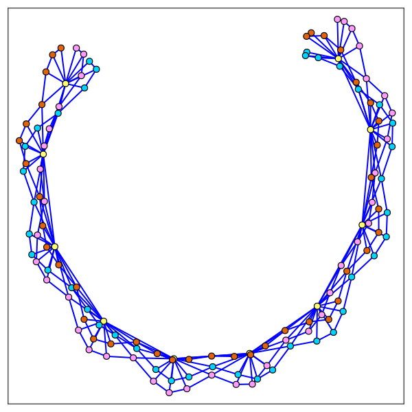
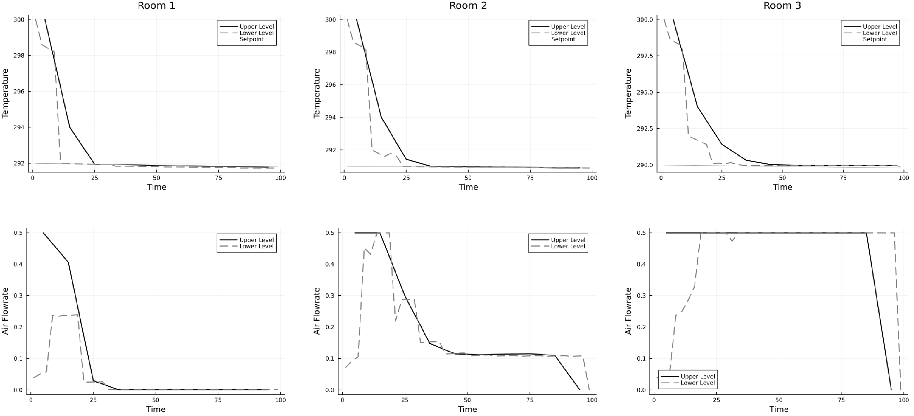

# Model Predictive Control of an HVAC System

By: Rishi Mandyam and David Cole

This example considers the problem outlined in ["A Hierarchical Distributed MPC for HVAC Systems"](https://ieeexplore.ieee.org/document/7525274) by Long et al. This problem considers the operation of a air conditioning unit that can control the temperature in adjacent rooms by changing how much air is sent into each room. For our purpose, we will consider a set of three rooms in series as shown below. 

  

The temperature of each room is influenced by the adjacent room temperature, the outside temperature, a disturbance term (e.g., heating from activity in the room), and the cooling from the AC unit. We can outline this problem as an NLP that seeks to minimize the difference between a set point temperature and the amount of power the AC unit uses. This problem has the form: 

```math
\begin{align*}
\min &\; \sum_{t \in \mathcal{T}} \sum_{i \in \mathcal{R}} (T_{i,t} - T^d_{i,t})^2 + \alpha (u_{i,t})^2\\
\textrm{s.t.} &\; C_i \frac{T_{i, t+1} - T_{i,t}}{\Delta t} = u_{i, t} C_p (T_s - T_{i,t}) + \sum_{j \in \mathcal{R}_i} (T_{j,t} - T_{i, t})/R_{i,j} + (T_{oa} - T_{i,t})/R_o + P^i_d, \quad i \in \mathcal{R} \\
&\; T_{i, 0} = \bar{T}_{i, 0}, \quad i \in \mathcal{R} \\
&\; \underline{m} \le u_{i, t} \le  \overline{m}, \quad i \in \mathcal{R} \\
&\; \underline{T} \le T_{i, t} \le \overline{T}, \quad i \in \mathcal{R}
\end{align*} 
```

Here, $\mathcal{T}$ and $\mathcal{R}$ are the set of times and the set of rooms, $T_{i, t}$ is the temperature of room $i$ at time $t$, $u_{i, t}$ is the air flow rate into a room, $C_i$ is thelumped mass of the room, $C_p$ is the heat capacity of air, $T_s$ is the temperature of the supply air coming into the room from the AC, $T_{oa}$ is the temperature of the outside air, and $R_*$ are resistences for heat transfer from the room to the outside or the other rooms, and $P^i_d$ is the disturbance term. The first constraint captures the dynamics of the system, the second constraint sets the initial temperature of the room, and the last two constraints add bounds to their respective variables.

In the original paper on the MPC system, they introduced a hierarchical approach with a coarse, upper layer to achieve set points and then a higher resolution lower layer. For simplicity, we will first walk through modeling this problem as a graph without hierarchy, and then we will introduce the hierarchical version. 

## Modeling HVAC MPC

To begin, we import the required packages. We also import PlasmoPlots.jl for visualizations

```julia
using JuMP
using Plasmo
using Ipopt
using Plots
using PlasmoPlots
```

Next, we set the constant values, most of which are from the paper by Long et al.

```Julia
# Thermal Dynamics into and between rooms
rho_air = 1.225 # kg/m^3
V_room = 50 # m^3

Ci = 9163 
cp = 1012 # heat capacity of air in room (J/kg*K)
Ts = 16+273 # temp of supply air (K)
Toa = 293 # temp of outside air (K)
Rij = .004 # thermal resistance between rooms i and j (K/W)
Rioa = .057 # thermal resistance between room and outside (K/W)
Pid = 1 # disturbance term from weather forecast; arbitrary
```

Next, we can define a function to initialize the graph and its variables. This function will take as arguments the number of time steps (`N`), the number of rooms (`num_rooms`), and the initial temperature set point (`T_init`). This function creates an OptiGraph with `N` nodes (each node representing a time point and containing all three rooms). Variables are added for temperature and for the AC flow rate, and an expression is created for the term $u_{i,t} C_p (T_s - T_{i, t})$ in the optimization problem (this will be used in the linking constraints between nodes). This function then sets the optimizer to be Ipopt and returns the graph and the set of nodes. Note that a finer resolution is also possible in the nodes by representing each room at each time point as a node (i.e., the nodes would capture both a spatial and temporal structure). However, we choose to place the variables for all rooms on one node (i.e., we are only capturing the temporal structure with the nodes). 

```julia
function MPC_HVAC(N, num_rooms, T_init, T_d)
    Tb = [270, 350] # (K) Lower and upper bounds of the temperature values
    ub = [.0005, .5] # (Kg/s) Lower and upper bounds of the air flowrate values

    graph = OptiGraph() # initialize the optigraph
    @optinode(graph, nodes[1:N]) # make a number of upperlayer nodes on the graph equal to N

    for (i, node) in enumerate(nodes)
        # Define temperature variables
        @variable(node, Tb[1] <= T[1:num_rooms] <= Tb[2], start = T_init)

        # Define flowrate variables
        @variable(node, ub[1] <= u[1:num_rooms] <= ub[2], start = 0)

        # Define expression for simplifying linking constraitns
        @expression(node, u_cp_T[j = 1:num_rooms], u[j] * cp * (Ts - T[j]))

        # Set the start point
        if i == 1
            @constraint(node, [j = 1:num_rooms], node[:T][j] == T_init)
        end
    end

    # Set Optimizer
    set_optimizer(graph, Ipopt.Optimizer);
    set_optimizer_attribute(graph, "max_iter", 100);

    return graph, nodes
end
```

Next, we define a function for adding the linking constraints between the nodes. This function takes as arguments the graph (`graph`), the nodes (`nodes`), the set point temperatures (`T_d`), and the time discretization (`dtu`). This function loops through the set of nodes and then loops through each room. Because there is heat transfer between the rooms, we have to define which rooms are adjacent, which is done with the if statements. We also set the objective function on each node, which minimizes a combination of the error (temperature difference from the set point) and the amount of power needed for the AC (assumed to be directly related to the total amount of air sent into the room). We include the constants `c1` and `c2` as weight/conversion factors on their respective terms. 

```julia
function add_room_linking!(graph, nodes, T_d, dtu)
    c1 = 10
    c2 = 0.5

    NU = length(nodes)
    for (i, node) in enumerate(nodes)
        for (room_num, T_var) in enumerate(node[:T])
            if node != nodes[NU] 
                T_var_next = nodes[i + 1][:T][room_num]

                if room_num == 1 # if in the first room of the system
                    T_sideroom = node[:T][room_num + 1]
                    @linkconstraint(graph, Ci * (T_var_next - T_var) / dtu ==
                        node[:u_cp_T][room_num] +
                        (T_sideroom − T_var) / Rij +
                        (Toa − T_var) / Rioa + Pid
                    ) # relationship between room temps

                elseif room_num == num_rooms # if in the last last room of the system
                    T_sideroom = node[:T][room_num - 1]
                    @linkconstraint(graph, Ci * (T_var_next - T_var) / dtu ==
                    node[:u_cp_T][room_num] +
                    (T_sideroom − T_var) / Rij +
                    (Toa − T_var) / Rioa + Pid
                ) # relationship between room temps

                else # if in a room surrounded by 2 rooms
                    T_sideroom1 = node[:T][room_num - 1]
                    T_sideroom2 = node[:T][room_num + 1]
                    @linkconstraint(graph, Ci * (T_var_next - T_var) / dtu ==
                        node[:u_cp_T][room_num] +
                        (T_sideroom1 − T_var) / Rij +
                        (T_sideroom2 − T_var) / Rij +
                        (Toa − T_var) / Rioa + Pid
                    )# relationship between room temps
                end
            end
        end
        # Set the objective
        @objective(node, Min,
        (c1 * (sum((node[:T][j] − T_d[i, j]) .^ 2 for j in (1:num_rooms)))
        + (c2 * sum(node[:u] .^ 2))).*dtu)
    end
end
```

### Example Simulation

Before introducing the hierarchical formulation, we will first show an example simulation without the hierarchy. First, we will define the data required for the functions we have defined. We use 10 time steps with a size of 10, and set the initial temperature to be 300K. To make the problem slightly more interesting. We set the set point temperatures, `T_d` to be different for each room and to be slowly decreasing. 

```julia
NU = 10
dtu = 10 # seconds
num_rooms = 3
T_init = 300 # Kelvin

T_d = zeros(NU, num_rooms)
T_d[:, 1] .= [292 - i * .02 for i in 1:NU]
T_d[:, 2] .= [291 - i * .01 for i in 1:NU]
T_d[:, 3] .= [290 - i * .02 for i in 1:NU]
```

With the data set, we next call our functions defined above. To set the graph's objective function to be equal to a sum of the objectives sotred on the nodes, we call `set_to_node_objectives`. Finally, we can call `optimize!` on the graph. 

```julia
graph, nodes = MPC_HVAC(NU, num_rooms, T_init);
add_room_linking!(graph, nodes, T_d, dtu)
set_to_node_objectives(graph)

optimize!(graph)
```

We can visualize the graph structure by using the package [PlasmoPlots.jl](https://github.com/plasmo-dev/PlasmoPlots.jl), as shown below. 

```julia
using PlasmoPlots

plt_graph = layout_plot(
    graph,
    node_labels=true,
    markersize=10,
    labelsize=8,
    linewidth=1,
    layout_options=Dict(
        :tol=>.01,
        :iterations=>300
    ),
    plt_options=Dict(
        :legend=>false,
        :framestyle=>:box,
        :grid=>false,
        :size=>(600,600),
        :axis => nothing
    )
)
```
This produces the visual shown below.



We can also query the solutions and visualize the performance of the system using the script below. Note that the `value` function requires first specifying the graph that has been optimized. This is because Plasmo supports having hierarchical, nested graphs that can contain the same variable objects, so we have to specify which graph to query the variable value from. 

```julia
T_room_1 = [value(graph, node[:T][1]) for node in nodes]
T_room_2 = [value(graph, node[:T][2]) for node in nodes]
T_room_3 = [value(graph, node[:T][3]) for node in nodes]

u_room_1 = [value(graph, node[:u][1]) for node in nodes]
u_room_2 = [value(graph, node[:u][2]) for node in nodes]
u_room_3 = [value(graph, node[:u][3]) for node in nodes]

t_range = 0:dtu:(NU*dtu - dtu)
plot(t_range, T_room_1, label = "Room 1", linewidth = 2, color = "blue")
plot!(t_range, T_dU[:, 1], label = "Set Point Room 1", linewidth = 1, color = "blue", linestyle = :dash)
plot!(t_range, T_room_2, label = "Room 2", linewidth = 2, color = "red")
plot!(t_range, T_dU[:, 2], label = "Set Point Room 2", linewidth = 1, color = "red", linestyle = :dash)
plot!(t_range, T_room_3, label = "Room 3", linewidth = 2, color = "black")
plot!(t_range, T_dU[:, 3], label = "Set Point Room 3", linewidth = 1, color = "black", linestyle = :dash)
xlabel!("Time")
ylabel!("Temperature (K)")

plot(t_range, u_room_1, label = "Room 1", linewidth = 2, color = "blue")
plot!(t_range, u_room_2, label = "Room 2", linewidth = 2, color = "red")
plot!(t_range, u_room_3, label = "Room 3", linewidth = 2, color = "black")
xlabel!("Time")
ylabel!("Air Flowrate")
```

The resulting figures can be seen below:





## Hierarchical Implementation

We can now extend our work above to the hierarchical instance. The hierarchical formulation includes an upper layer and a lower layer. The upper layer solves the MPC formulation with a coarse time resolution. One challenge of the MPC formulation is that each room is linked to the room next to it, so each room cannot be solved independently, and the computational requirements grow with the number of rooms. To address this challenge, Long et al. propose using the solution of the coarse resolution problem to estimate the temperature of the adjacent rooms, and then solve each room independently with a finer time resolution. In other words, the finer resolution problem is solved for each room $i$, and for the expression $\sum_{j \in \mathcal{R}_i} (T_{j,t} - T_{i, t})/R_{i,j}$, the terms $T_{j, t}$ are set as constants based on the solution of the coarse upper level problem. 

We will build this problem in Plasmo.jl, but, to highlight the modeling capabilities of Plasmo.jl, we will not fully make each lower level graph independent of the upper layer (though they will not be linked to other lower layer graphs). The upper layer will be represented by a single subgraph, and Instead, we will use a linking constraint between the upper and lower layers and directly link the upper layer variables to the lower layers. This captures the structure of the different layers with links between them, and it is a structure that could be potenially exploited by different decomposition approaches (e.g., Generalized Benders Decomposition). In this case, we will use one subgraph for the upper layer and then we will create a subgraph for each room on the lower layer (i.e., we will have one subgraph representing the upper layer and three subgraphs representing the lower layer). This allows us to reuse some of the functions we have defined above. However, we will have to define a function for linking the lower layers to the upper layers. 

To begin, we will first define a function to map the index of the lower level to the upper level since they use different temporal resolutions. 

```julia
function map_L_to_U(idx, NU, NL)
    nl_per_nu = Int(NL / NU)

    return Int(ceil(idx / nl_per_nu))
end
```

Next, we will define a new function that will operate similar to `add_room_linking!`. The upper and lower level problem subgraphs are "owned" by an overall graph, which is what will "own" the linking constraints. Since each lower level graph represents a single room (and the upper level graph includes all three rooms), this function will take the lower level nodes (`nodes`), the upper level nodes (`ref_nodes`), the set point values (`Tdl`), the time resolution of the lower level (`dtl`), and the room number (`room_num`). Like `add_room_linking!`, this function links across time points, but for the term using the temperature of the adjacent room, it uses the temperature from the upper level. This function also sets the objective of the lower level. We call this new function `add_hierarchical_room_linking!`. 

```julia
function add_hierarchical_room_linking!(overall_graph, nodes, ref_nodes, NU, NL, TdL, dtl, room_num)
    c1 = 10
    c2 = 0.5

    for (i, node) in enumerate(nodes)
        if node != nodes[NL] 
            T_var = nodes[i + 1][:T][1]
            T_var_next = nodes[i + 1][:T][1]
            node_ref_idx = map_L_to_U(i, NU, NL)

            if room_num == 1 # if in the first room of the system
                T_ref = ref_nodes[node_ref_idx][:T][room_num + 1]
                @linkconstraint(overall_graph, Ci * (T_var_next - T_var) / dtl ==
                    node[:u_cp_T][1] +
                    (T_ref − T_var) / Rij +
                    (Toa − T_var) / Rioa + Pid
                ) # relationship between room temps

            elseif room_num == num_rooms # if in the last last room of the system
                T_ref = ref_nodes[node_ref_idx][:T][room_num - 1]
                @linkconstraint(overall_graph, Ci * (T_var_next - T_var) / dtl ==
                node[:u_cp_T][1] +
                (T_ref − T_var) / Rij +
                (Toa − T_var) / Rioa + Pid
            ) # relationship between room temps

            else # if in a room surrounded by 2 rooms
                T_ref1 = ref_nodes[node_ref_idx][:T][room_num - 1]
                T_ref2 = ref_nodes[node_ref_idx][:T][room_num + 1]
                @linkconstraint(overall_graph, Ci * (T_var_next - T_var) / dtl ==
                    node[:u_cp_T][1] +
                    (T_ref1 − T_var) / Rij +
                    (T_ref2 − T_var) / Rij +
                    (Toa − T_var) / Rioa + Pid
                )# relationship between room temps
            end
        end
        @objective(node, Min,
        (c1 * (sum((node[:T][1] − TdL[i, room_num]) .^ 2))
        + (c2*sum(node[:u] .^ 2))).*dtl)
    end
end
```

Lastly, Long et al. propose that the temperature of the lower layers should be within some value of the upper layers (that is, the lower layer should not deviate too much from the upper layer). As the time horizon increases, the deviation from the upper layer is allowed to increase as well. We add this constraint in the function `add_deviation_constraints` below

```julia
function add_deviation_constraints!(graph, nodes, ref_nodes, NU, NL, room_num, epsilon, r)
    for (i, node) in enumerate(nodes)
        node_ref_idx = map_L_to_U(i, NU, NL)

        for room_num in 1:num_rooms # The absolute value of the deviation from the upper layer remains within some bound
            @linkconstraint(graph, nodes[i][:T][1] -  ref_nodes[node_ref_idx][:T][room_num] <= epsilon * (1 + i * r))
            @linkconstraint(graph, - nodes[i][:T][1] + ref_nodes[node_ref_idx][:T][room_num] <= epsilon * (1 + i * r))
        end
    end
end
```

Note that each of the above functions could be revised to use the solution value of the upper layer by calling `value(upper_graph, ref_nodes[node_ref_idx][:T][room_num])` where the variable appears in the link constraints. 

### Example Simulation

We can now run an example problem of this hierarchical problem. To begin, we define the data for the upper and lower levels. Here, we will use 10 time points for the upper layer and 40 time points for the lower layer. 

```julia
NL = 40
NU = 10
dtu = 10
dtl = 2.5
num_rooms = 3
T_init = 300 # Kelvin

T_dU = zeros(NU, num_rooms)
T_dU[:, 1] .= [292 - i * .02 for i in 1:NU]
T_dU[:, 2] .= [291 - i * .01 for i in 1:NU]
T_dU[:, 3] .= [290 - i * .02 for i in 1:NU]

T_dL = zeros(NL, num_rooms)
T_dL[:, 1] .= [292 - i * .02 * .25 for i in 1:NL]
T_dL[:, 2] .= [291 - i * .01 * .25 for i in 1:NL]
T_dL[:, 3] .= [290 - i * .02 * .25 for i in 1:NL]
```

We can next define the upper and lower level graphs. Since each lower level graphs only contain one room, we set the `num_rooms` argument of the `MPC_HVAC` function to be 1. We then add each of these subgraphs to an overall graph.

```julia
Ugraph, Unodes = MPC_HVAC(NU, num_rooms, T_init);

Lgraph1, Lnodes1 = MPC_HVAC(NL, 1, T_init);
Lgraph2, Lnodes2 = MPC_HVAC(NL, 1, T_init);
Lgraph3, Lnodes3 = MPC_HVAC(NL, 1, T_init);

graph = OptiGraph()
add_subgraph!(graph, Ugraph)
add_subgraph!(graph, Lgraph1)
add_subgraph!(graph, Lgraph2)
add_subgraph!(graph, Lgraph3)
```

Next, we can add the linking constraints across layers (and within the upper level graph). 

```julia
add_room_linking!(Ugraph, Unodes, T_dU, dtu) # add links to upper layer

# Link lower levels to upper levels
add_hierarchical_room_linking!(graph, Lnodes1, Unodes, NU, NL, T_dL, dtl, 1)
add_hierarchical_room_linking!(graph, Lnodes2, Unodes, NU, NL, T_dL, dtl, 2)
add_hierarchical_room_linking!(graph, Lnodes3, Unodes, NU, NL, T_dL, dtl, 3)

add_deviation_constraints!(graph, Lnodes1, Unodes, NU, NL, 1, 1, .2)
add_deviation_constraints!(graph, Lnodes2, Unodes, NU, NL, 2, 1, .2)
add_deviation_constraints!(graph, Lnodes3, Unodes, NU, NL, 3, 1, .2)
```

We can visualize the structure of this problem by using PlasmoPlots.jl. Here, we will omit node labels and we will color each subgraph its own color. 

```julia
plt_graph = layout_plot(
    graph,
    node_labels=false,
    markersize=5,
    labelsize=8,
    linewidth=2,
    subgraph_colors = true,
    layout_options=Dict(
        :tol=>.01,
        :iterations=>500,
        :C => 50,
        :K => 1
    ),
    plt_options=Dict(
        :legend=>false,
        :framestyle=>:box,
        :grid=>false,
        :size=>(600,600),
        :axis => nothing
    )
)
```

The resulting structure can be seen below. 



With those linking constraints added, we can now solve the problem. 

```julia
set_to_node_objectives(graph)
set_optimizer(graph, Ipopt.Optimizer)
set_optimizer_attribute(graph, "max_iter", 200)

optimize!(graph)
```

After optimizing the graph, we can query and plot the solutions.

```julia
# Query solutions of Temperatures
T_room1L = [value(graph, Lgraph1[:nodes][i][:T][1]) for i in 1:Plasmo.num_nodes(Lgraph)]
T_room1U = [value(graph, Ugraph[:nodes][i][:T][1]) for i in 1:Plasmo.num_nodes(Ugraph)]
T_room2L = [value(graph, Lgraph2[:nodes][i][:T][1]) for i in 1:Plasmo.num_nodes(Lgraph)]
T_room2U = [value(graph, Ugraph[:nodes][i][:T][2]) for i in 1:Plasmo.num_nodes(Ugraph)]
T_room3L = [value(graph, Lgraph3[:nodes][i][:T][1]) for i in 1:Plasmo.num_nodes(Lgraph)]
T_room3U = [value(graph, Ugraph[:nodes][i][:T][3]) for i in 1:Plasmo.num_nodes(Ugraph)]

# Query solutions of flowrates
u_room1L = [value(graph, Lgraph1[:nodes][i][:u][1]) for i in 1:Plasmo.num_nodes(Lgraph)]
u_room1U = [value(graph, Ugraph[:nodes][i][:u][1]) for i in 1:Plasmo.num_nodes(Ugraph)]
u_room2L = [value(graph, Lgraph2[:nodes][i][:u][1]) for i in 1:Plasmo.num_nodes(Lgraph)]
u_room2U = [value(graph, Ugraph[:nodes][i][:u][2]) for i in 1:Plasmo.num_nodes(Ugraph)]
u_room3L = [value(graph, Lgraph3[:nodes][i][:u][1]) for i in 1:Plasmo.num_nodes(Lgraph)]
u_room3U = [value(graph, Ugraph[:nodes][i][:u][3]) for i in 1:Plasmo.num_nodes(Ugraph)]

# Set time ranges
t_rangeU = (0:dtu:(NU*dtu - dtu))
t_rangeL = (0:dtl:(NL*dtl - dtl))

# Plot solutions
plot(t_rangeU, T_room1U, color = "black", label = "Upper Level", linewidth = 2 )
plot!(t_rangeL, T_room1L, color = "gray", label = "Lower Level", linewidth = 2, ls = :dash )
plot!(t_rangeL, T_dL[:, 1], color = "darkgray", label = "Setpoint", linewidth = 1)
xlabel!("Time")
ylabel!("Temperature")
title!("Room 1")

plot(t_rangeU, T_room2U, color = "black", label = "Upper Level", linewidth = 2 )
plot!(t_rangeL, T_room2L, color = "gray", label = "Lower Level", linewidth = 2, ls = :dash )
plot!(t_rangeL, T_dL[:, 2], color = "darkgray", label = "Setpoint", linewidth = 1)
xlabel!("Time")
ylabel!("Temperature")
title!("Room 2")

plot(t_rangeU, T_room3U, color = "black", label = "Upper Level", linewidth = 2 )
plot!(t_rangeL, T_room3L, color = "gray", label = "Lower Level", linewidth = 2, ls = :dash )
plot!(t_rangeL, T_dL[:, 3], color = "darkgray", label = "Setpoint", linewidth = 1)
xlabel!("Time")
ylabel!("Temperature")
title!("Room 3")

plot(t_rangeU, u_room1U, color = "black", label = "Upper Level", linewidth = 2 )
plot!(t_rangeL, u_room1L, color = "gray", label = "Lower Level", linewidth = 2, ls = :dash)
xlabel!("Time")
ylabel!("Air Flowrate")

plot(t_rangeU, u_room2U, color = "black", label = "Upper Level", linewidth = 2 )
plot!(t_rangeL, u_room2L, color = "gray", label = "Lower Level", linewidth = 2, ls = :dash)
xlabel!("Time")
ylabel!("Air Flowrate")

plot(t_rangeU, u_room3U, color = "black", label = "Upper Level", linewidth = 2 )
plot!(t_rangeL, u_room3L, color = "gray", label = "Lower Level", linewidth = 2, ls = :dash)
xlabel!("Time")
ylabel!("Air Flowrate")
```

The plots of the solution are shown below


