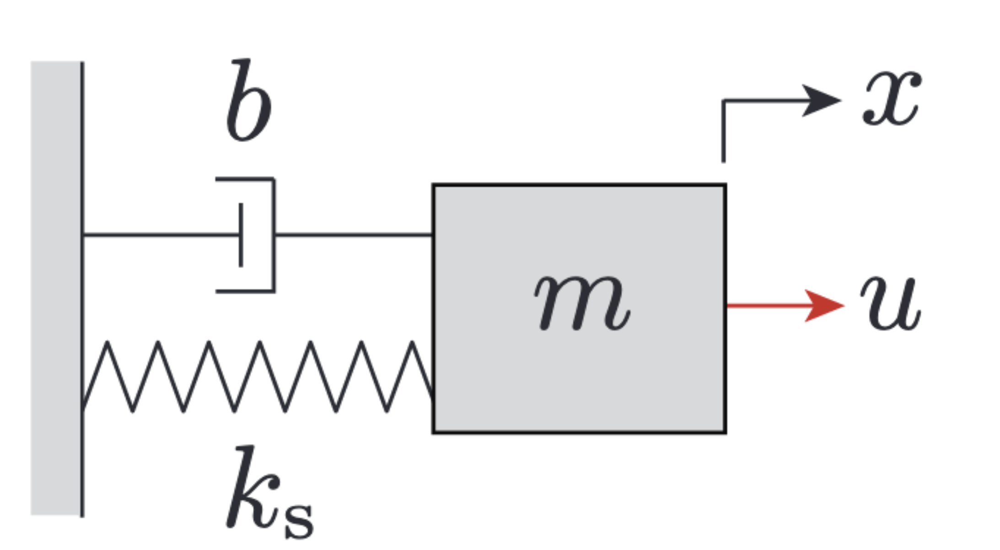
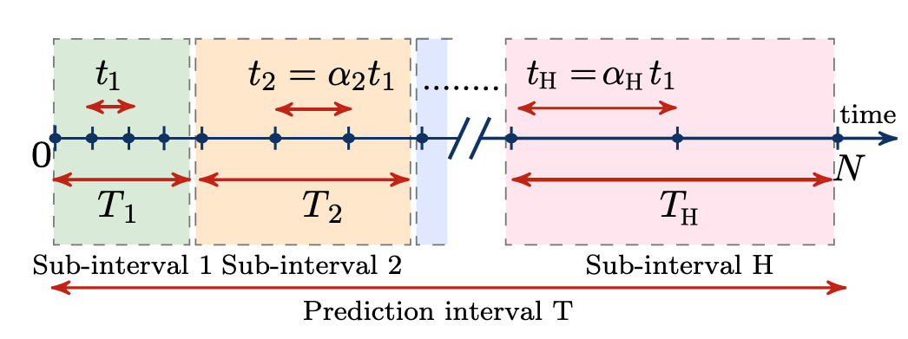
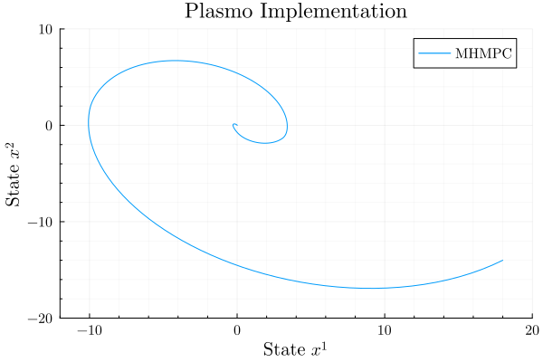

# Multi-horizon Model Predictive Control

By: Kiernan Jennings

This tutorial is an introduction to formulation in the graph-based modelling framework Plasmo.jl (Platform for Scalable Modeling and Optimization) for beginners in optimization.

## Mathematical Formulation

The following problem comes from Behrunani, Heer, Smith, and Lygeros
(Behrunani, V., Heer, P., Smith, R., & Lygeros, J. (2024). Recursive feasibility guarantees in multi-horizon MPC. 6 p. https://doi.org/10.3929/ETHZ-B-000707918)

Model Predictive Control (MPC) is a well-established method for optimal control of constrained systems. It relies on a dynamic model and real-time feedback to continuously optimize control inputs by predicting future system responses. However, a key limitation of traditional MPC is its fixed prediction horizon, which may not adequately balance short-term and long-term decision-making.

Multi-Horizon Model Predictive Control (MH-MPC) addresses this limitation by dividing the prediction horizon into multiple sub-intervals, each with a different sampling time. This approach optimizes control over both short and long time horizons, ensuring that immediate decisions align with long-term objectives.

In this problem, MH-MPC is applied to a linear mass-spring-damper system, demonstrating its effectiveness in handling dynamic control tasks. 

 

Figure taken from Behrunani, et al.


This problem includes the following sets:

* State variables at time $k$ ($x_k$)
* Input variables at time $k$ ($u_k$)
* State cost matrices ($Q_i$)
* Input cost matrices ($R_i$)
* System cost matrices ($A_i, B_i$)

Each sub-interval of MH-MPC is labeled using $i \in H$. The cost matrices are defined for each sub-interval. Let $\mathbb{K}$ be the set of all time steps $k$ within each sub-interval $i$ and $N_i$ be the cardinality of set $\mathbb{K}_i$. Also, the control invariant set $\mathbb{X}_{CI} \subseteq \mathbb{X}$.

An important distinction for MH-MPC is the dual time horizon that is used in the optimization problem. This is encapsulated in a time horizon uses a diffusing-horizon (available here: https://ieeexplore.ieee.org/document/9658150). To define these time steps in the MH-MPC problem, the sampling time of the $i^\text{th}$ sub-interval is $t_i = \alpha_i t_1 (\alpha_1 = 1)$ where $\alpha_i \in \mathbb{Z}_{\geq1}$ and increasing such that $\alpha_1 \lt \alpha_2 \lt ... \lt \alpha_{H-1} \lt \alpha_{H}$. Visually, this is described below.

 
Figure taken from Behrunani et al.


The MH-MPC optimization problem can be written as:

```math
\begin{aligned}
    \min_{\{ x_k, u_k\}^N_{k=0}} \quad & \sum_{i \in \mathbb{H}} \left( \sum_{k \in \mathbb{K}_i} \left( x_k^\intercal Q_i x_k + u_k^\intercal R_i u_k \right) \right) + x_N^\intercal Q_H x_N\\
    \textrm{s.t.} \quad & x_{k+1} = A_i x_k + B_i u_k, \quad\forall k \in \mathbb{K}_i, \forall i \in \mathbb{H} \\
    & x_k \in \mathbb{X}, \forall k \in \mathbb{Z}_{0:N} \\
    & u_k \in \mathbb{U}, \forall k \in \mathbb{Z}_{0:N-1} \\
    & x_N \in \mathbb{X}_{CI}
\end{aligned}
```

## Modeling in Plasmo

The general idea is to use a graph-based approach to model the sub-intervals as sub-graphs with each node is a specific time point. This will all be encapsulated under one master graph. This implementation is shown below.

 

### 1. Import packages and define constants

This section serves to define the constants given for the problem statement and import the necessary packages to be used in this program. ``Ipopt`` is used as a nonlinear programming solver. 

```julia
using Plasmo
using Ipopt

# Constants given:
m = 0.5 # kg
k = 0.5 # N/m (spring constant)
b = 0.25 # Ns/m (damping constant)

t_i = [0.05;0.1;0.2;0.4;0.8] # Discretization for each sub-interval
N_i = [4;6;4;4;2] # Cardinality of K_i
T_i = [0.2;0.6;0.8;1.6;1.6] # Total time spanned by each sub-interval
K_i = [[0,3];[4,9];[10,13];[14,17];[18,19]] # Set of all time steps k in each sub-interval (excludes termination)

R = Diagonal([1.0])  # input cost matrix 
Q = Diagonal([1.0, 1.0])

NX = 2 # Number of x variables [position, velocity]
NU = 1 # Number of u variables [force]
```

### 2. Make graph structure

We define our graph and subgraph structure. This encapsulates the MH-MPC approach for each $H$ sub-interval  $i \in H$. Here $H = 5$. To run the entire optimization over a set time period, we will wrap the model construction and optimization (steps 2 through 5) in a function called ``MHMPC``.

```julia
function add_horizon_subgraphs()
    # All of the subgraphs
    graph_SG1 = OptiGraph()
    graph_SG2 = OptiGraph()
    graph_SG3 = OptiGraph()
    graph_SG4 = OptiGraph()
    graph_SG5 = OptiGraph()
    
    subgraphs_all = [graph_SG1, graph_SG2, graph_SG3, graph_SG4, graph_SG5]
    
    # Initialize all nodes for subgraphs
    @optinode(graph_SG1, nodes1[1:N_i[1]])
    @optinode(graph_SG2, nodes2[1:N_i[2]])
    @optinode(graph_SG3, nodes3[1:N_i[3]])
    @optinode(graph_SG4, nodes4[1:N_i[4]])
    @optinode(graph_SG5, nodes5[1:N_i[5]])
    
    nodes_all = [graph_SG1[:nodes1], graph_SG2[:nodes2], graph_SG3[:nodes3], graph_SG4[:nodes4], graph_SG5[:nodes5]]
    return subgraphs_all, nodes_all
end
```

The second parameter of ``@optinode`` will initialize $N_i$ nodes. They can be referenced (as seen later) by calling the name and the subsequent index of that specific node (e.g. ``nodes2[1]`` for the first node of the second subgraph.). The arrays ``subgraphs_all`` and ``nodes_all`` are used for easier, ordered indexing.

### 3. Initialize variables for each node

This step is necessary for initializing the state and input variables. Recall, each node is representative of a time point in the MH-MPC problem. ``@variable`` is a macro to initialize a variable for the specific node in the first parameter. The constraints for $x$ and $u$ are implemented using the inequality constraints seen in the second parameter. Additionally, the vector notation for $x,u$ will initialize each variable as a vector of size $NX, NU$, respectively.

``@expression`` is another macro that defines a specific symbolic expression for each node. This expression will add simplifications for the following code representative of the first equality constraint: $x_{k+1} = A_k x_k + B_k x_k$. This expression is named via the second parameter.

Additionally, the initial condition for this problem is defined for $t=0$, where $x_0 = [18\quad \mathord{-} 14]$. The ``fix`` function will fix a specified variable.

```julia
function add_variables!(subgraphs_all, t_i, x0)
    for (subgraph, t_step) in zip(subgraphs_all, t_i)
        # Instantiate x,u for each node (time point)
        for node in all_nodes(subgraph)
            @variable(node, -20 <= x[1:NX] <= 20)
            @variable(node, -0.5 <= u[1:NU]<= 0.5)
    
            @variable(node, dt == t_step)
    
            A = [1 dt; -dt (1-dt/2)]
            B = [0 ; 2*dt]
    
            @expression(node, Ax_Bu[i = 1:NX],  A[i, 1] * node[:x][1] + A[i, 2] * node[:x][2] + B[i] * node[:u][1])
        end
    end

    # Set initial condition for t1
    fix.(subgraphs_all[1][:nodes1][1][:x][1], x0[1]; force=true)
    fix.(subgraphs_all[1][:nodes1][1][:x][2], x0[2]; force=true)
end
```

### 4. Adding linking constraints

A linking constraint (`@linkconstraint`) is necessary for connectivity between nodes. In this case, the next time point in a sub-graph must be connected using the equality constraint mentioned prior. Here, we are equating $x$ for the future time point to the `@expression` of the current time point, defined in step 3.

An important tip for using the `@linkconstraint` macro is using the loop in the second parameter to loop through a variable ($j$ in this case).

In order to connect nodes between the subgraphs, you must reference the `graph_master` due to the scope of the variables. `graph_master` has access to all variables from all subgraphs, after all subgraphs were added  to the master graph. The `@linkconstraint` structure here is the same as connecting between individual subgraphs; taking the expression from the last node in the subgraph then setting it equal to the first $x$ value of the next node.

```julia
function add_constraints!(graph_master, subgraphs_all, nodes_all)
    # Adding linking constraints between nodes in individual SG's
    for (subgraph, cardinality, node) in zip(subgraphs_all, N_i, nodes_all)   
        @linkconstraint(subgraph, [j = 1:(cardinality-1)], node[j+1][:x][1] == node[j][:Ax_Bu][1])
        @linkconstraint(subgraph, [j = 1:(cardinality-1)], node[j+1][:x][2] == node[j][:Ax_Bu][2])
    end

    # Add subgraphs to master graph
    for subgraph in subgraphs_all
        add_subgraph(graph_master, subgraph)
    end
    
    # Add linking constraint between subgraphs
    @linkconstraint(graph_master, [n = 1:(length(subgraphs_all)-1)], nodes_all[n+1][1][:x][1] == nodes_all[n][N_i[n]][:Ax_Bu][1])
    @linkconstraint(graph_master, [n = 1:(length(subgraphs_all)-1)], nodes_all[n+1][1][:x][2] == nodes_all[n][N_i[n]][:Ax_Bu][2])
end
```

### 5. Setting objective and running optimization

The final step is to set the objective and run the optimization. This step is written out in the mathematic formulation and is just written out. The code to run the optimization is straight forward as well. `set_to_node_objectives` is a newer function that is required for solving the optimization problem.

The resulting output is the optimal values for $x, u$. For plotting and running this optimization over a long time period, we return the arrays of state variables and input variables. Recall, the code from step 2 to this step is wrapped in a function.

```julia
function add_objective!(graph_master)
    # Set objective
    @objective(
        graph_master, 
        Min, 
        sum(node[:u]' * R * node[:u] for node in all_nodes(graph_master)) +
        sum(node[:x]' * Q * node[:x] for node in all_nodes(graph_master)),
    )
end
    
function MHMPC(x0)
    graph_master = OptiGraph() # This will contain all subgraphs
    set_optimizer(graph_master, Ipopt.Optimizer)

    subgraphs_all, nodes_all = add_horizon_subgraphs()
    add_variables!(subgraphs_all, t_i, x0)
    add_constraints!(graph_master, subgraphs_all, nodes_all)
    add_objective!(graph_master)

    # Run optimization
    set_to_node_objectives(graph_master)
    set_optimizer_attribute(graph_master, "print_level", 0)
    optimize!(graph_master)

    vals_x = []
    vals_y = []
    vals_u = []

    for node in all_nodes(graph_master)
        push!(vals_x, value(graph_master, node[:x][1]))
        push!(vals_y, value(graph_master, node[:x][2]))
        push!(vals_u, value(graph_master, node[:u][1]))
    end

    return vals_x, vals_y, vals_u
end
```

### 6. Run the program

In context of the spring damper system, we want to apply an optimal force $u$ to dampen the system to position $0$, and $0$ velocity. This optimization problem will give values for $u$ at each time discretization node. For our purposes, we choose to run this program an arbitrary $400$ times, once every $0.05$ seconds. Thus every time step ($0.05$ seconds), the future state variables will be parameters to the next optimization problem.

```julia
function run_sim(T::Int = 401)
    x_arr = Vector{Vector{Float64}}() # array of state variables at each timepoint
    u_arr = Vector{Float64}() # array of input variables at each time point

    x = [18.0, -14.0]
    push!(x_arr, x)

    for _ in 2:T
        vals_x1, vals_x2, vals_u = MHMPC(x)
        x = [vals_x1[2], vals_x2[2]]
        push!(x_arr, x)
        push!(u_arr, vals_u[1])
    end

    return x_arr, u_arr
end


x_sim, u_sim = run_sim()
```

Now, plotting the values of $x$ from our program:

 
