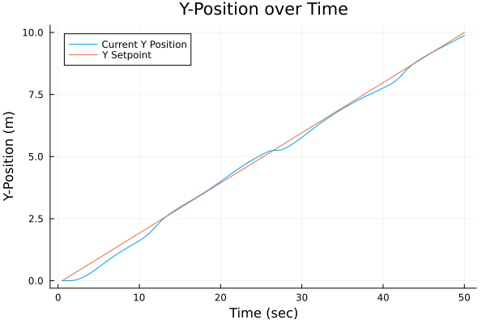
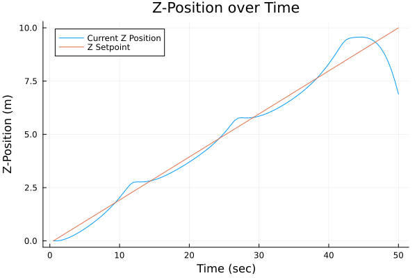

# Optimal Control of a Quadcopter

By: Rishi Mandyam

This tutorial notebook is an introduction to the graph-based modeling framework 
Plasmo.jl (Platform for Scalable Modeling and Optimization) for JuMP 
(Julia for Mathematical Programming).

The following problem comes from the paper of Na, Shin,  Anitescu, and Zavala (available [here](https://ieeexplore.ieee.org/stamp/stamp.jsp?arnumber=9840913)).

A quadcopter operates in 3-D space with positions $(x, y, z)$ and angles ($\gamma$, $\beta$, and $\alpha$). 
$g$ is the graviational constant. The set of state variables at time $t$ are treated as $\boldsymbol{x}_t = (x, y, z, \dot{x}, \dot{y}, \dot{z}, \gamma, \beta, \alpha)$. 
The input variables at time $t$ are $\boldsymbol{u}_t = (a, \omega_x, \omega_y, \omega_z)$. 

The quadcopter control problem can be written as an optimization problem as:

```math
\begin{align*}
    \min &\; \phi(t) := \int_{0}^T \frac{1}{2} (\boldsymbol{x}(t) - \boldsymbol{x}(t)^{ref})^\top Q (\boldsymbol{x}(t) - \boldsymbol{x}(t)^{ref}) + \boldsymbol{u}(t)^\top R \boldsymbol{u}(t) dt \\
    \textrm{s.t.} &\; \frac{d^2x}{dt^2} = a (\cos(\gamma) \sin( \beta) \cos (\alpha)  + \sin (\gamma) \sin (\alpha)) \\
&\; \frac{d^2 y}{dt^2} = a (\cos (\gamma) \sin (\beta) \sin (\alpha) - \sin (\gamma) \cos (\alpha)) \\
&\; \frac{d^2 z}{dt^2} = a \cos (\gamma) \cos (\beta) - g \\
&\; \frac{d\gamma}{dt} = (\omega_x \cos (\gamma) + \omega_y \sin (\gamma)) / \cos (\beta)\\
&\;\frac{d\beta}{dt} = -\omega_x \sin (\gamma) + \omega_y \cos (\gamma) \\
&\;\frac{d\alpha}{dt} = \omega_x \cos (\gamma) \tan (\beta) + \omega_y \sin (\gamma) \tan (\beta) + \omega_z
\end{align*}
```

We will model this problem in Plasmo by discretizing the problem into finite time points and representing each time point with a node. 

### 1. Import Packages
To begin, we will import and use the necessary packages

```julia 
using JuMP
using Plasmo
using Ipopt
using Plots
using LinearAlgebra
```

### 2. Function Design

We will define a function called `build_quadcopter_graph` that will take arguments for the number of nodes and the discretization size (i.e., $\Delta t$), optimize the model, and return the graph and reference values $x^{ref}$.  

The function inputs are:
- number of nodes (`N`)
- time discretization (number of seconds between nodes `dt`)

The function outputs are:
- The objective value of the discretized form of $\phi$
- The graph
- An array with the reference values on each node ($x^{ref}$)

The `build_quadcopter_graph` function will use three supporting functions that will add variables, add constraints (both local and linking) and add the objectives to the nodes. These functions will be detailed below before they are used to build the full quadcopter graph. 

The first function we call `add_variables!`, which defines each of the decision variables as well as some supporting expressions. Here, we loop through the nodes, and define variables on each node. These variables include expressions that will simplify forming the linking constrints (these are the right hand sides of the derivatives). 
```julia
function add_variables!(nodes)
    grav = 9.8 # m/s^2

    for (i, node) in enumerate(nodes)
        # Create state variables
        @variable(node, g)
        @variable(node, b)
        @variable(node, a)

        @variable(node, X)
        @variable(node, Y)
        @variable(node, Z)

        @variable(node, dXdt)
        @variable(node, dYdt)
        @variable(node, dZdt)

        # Create input variables
        @variable(node, C_a)
        @variable(node, wx)
        @variable(node, wy)
        @variable(node, wz)

        # These expressions to simplify the linking constraints later
        @expression(node, d2Xdt2, C_a * (cos(g) * sin(b) * cos(a) + sin(g) * sin(a)))
        @expression(node, d2Ydt2, C_a * (cos(g) * sin(b) * sin(a) + sin(g) * cos(a)))
        @expression(node, d2Zdt2, C_a * cos(g) * cos(b) - grav)

        @expression(node, dgdt, (wx * cos(g) + wy * sin(g)) / (cos(b)))
        @expression(node, dbdt, - wx * sin(g) + wy * cos(g))
        @expression(node, dadt, wx * cos(g) * tan(b) + wy * sin(g) * tan(b) + wz)
    end
end
```    

Next, we define a function for adding the constraints to the graph. We will set the initial values at time 0 and then define the linking constraints, which are discretized derivatives. Note that both linear and nonlinear constraints are handled in the same way by the user in both the `@constraint` and `@linkconstraint` macros. 

```julia
function add_constraints!(graph, nodes, dt)
    N = length(nodes)

    @constraint(nodes[1], nodes[1][:X] == 0)
    @constraint(nodes[1], nodes[1][:Y] == 0)
    @constraint(nodes[1], nodes[1][:Z] == 0)
    @constraint(nodes[1], nodes[1][:dXdt] == 0)
    @constraint(nodes[1], nodes[1][:dYdt] == 0)
    @constraint(nodes[1], nodes[1][:dZdt] == 0)
    @constraint(nodes[1], nodes[1][:g] == 0)
    @constraint(nodes[1], nodes[1][:b] == 0)
    @constraint(nodes[1], nodes[1][:a] == 0)

    for i in 1:(N-1) # iterate through each node except the last
        @linkconstraint(graph, nodes[i+1][:dXdt] == dt*nodes[i][:d2Xdt2] + nodes[i][:dXdt])
        @linkconstraint(graph, nodes[i+1][:dYdt] == dt*nodes[i][:d2Ydt2] + nodes[i][:dYdt])
        @linkconstraint(graph, nodes[i+1][:dZdt] == dt*nodes[i][:d2Zdt2] + nodes[i][:dZdt])

        @linkconstraint(graph, nodes[i+1][:g] == dt*nodes[i][:dgdt] + nodes[i][:g])
        @linkconstraint(graph, nodes[i+1][:b] == dt*nodes[i][:dbdt] + nodes[i][:b])
        @linkconstraint(graph, nodes[i+1][:a] == dt*nodes[i][:dadt] + nodes[i][:a])

        @linkconstraint(graph, nodes[i+1][:X] == dt*nodes[i][:dXdt] + nodes[i][:X])
        @linkconstraint(graph, nodes[i+1][:Y] == dt*nodes[i][:dYdt] + nodes[i][:Y])
        @linkconstraint(graph, nodes[i+1][:Z] == dt*nodes[i][:dZdt] + nodes[i][:Z])
    end
end
```

Next, we set a function for defining the objectives. The quadcopter will fly in a linear upward path in the positive X, Y, and Z directions. We combine these vectors into another vector which we call $x^{ref}$, and then define the necessary constants and arrays (this will simplify forming the objective function).

```julia
function add_objective!(nodes, N, dt)
    X_ref = 0:10/N:10;
    dXdt_ref = zeros(N);
    Y_ref = 0:10/N:10;
    dYdt_ref = zeros(N)
    Z_ref = 0:10/N:10;
    dZdt_ref = zeros(N);
    g_ref = zeros(N);
    b_ref = zeros(N);
    a_ref = zeros(N);

    xk_ref = [X_ref, dXdt_ref, Y_ref, dYdt_ref, Z_ref, dZdt_ref, g_ref, b_ref, a_ref];

    Q = diagm([1, 0, 1, 0, 1, 0, 1, 1, 1]);
    R = diagm([1/10, 1/10, 1/10, 1/10]);

    xk_ref1 = zeros(N,9)
    for i in (1:N)
        for j in 1:length(xk_ref)
            xk_ref1[i,j] = xk_ref[j][i]
        end
    end

    for (i, node) in enumerate(nodes)
        xk = [ # Array to hold variables
            node[:X],
            node[:dXdt],
            node[:Y],
            node[:dYdt],
            node[:Z],
            node[:dZdt],
            node[:g],
            node[:b],
            node[:a]
        ]

        xk1 = xk .- xk_ref1[i, :] # Array to hold the difference between variable values and their setpoints.
        uk = [node[:C_a], node[:wx], node[:wy], node[:wz]]
        @objective(node, Min, (1 / 2 * (xk1') * Q * (xk1) + 1 / 2 * (uk') * R * (uk)) * dt)
    end
    return xk_ref
end
```

We can now define the function for building the optigraph. We initialize an OptiGraph and set the optimizer. We then define `N` nodes on the OptiGraph `graph`. We then call the three functions above and call `set_to_node_objectives` to set the graph's objective to the nodes' objectives we have defined. We can then call `optimize` and return the objective value, the graph, and the reference points. 
```julia
function build_quadcopter_graph(N, dt)
    graph = OptiGraph()
    solver = optimizer_with_attributes(Ipopt.Optimizer, "max_iter" => 100)
    set_optimizer(graph, solver)
    @optinode(graph, nodes[1:N])

    add_variables!(nodes)
    add_constraints!(graph, nodes, dt)
    xk_ref = add_objective!(nodes, N, dt)

    set_to_node_objectives(graph)

    optimize!(graph);

    return objective_value(graph), graph, xk_ref
end
```

Now that we have created our function to model the behavior of the quadcopter,
we can test it using some example cases.

### Examples
First, we will run an example with 50 time points (each represented by a node) with a time discretization size of 0.1 seconds

```julia
N = 50
dt = 0.1
objv, graph, xk_ref = build_quadcopter_graph(N, dt)
nodes = getnodes(graph)
# create empty arrays
CAval_array = zeros(length(nodes))
xval_array = zeros(length(nodes))
yval_array = zeros(length(nodes))
zval_array = zeros(length(nodes))

# add values to arrays
for (i, node)  in enumerate(nodes)
    CAval_array[i] = value(node[:C_a])
    xval_array[i] = value(node[:X])
    yval_array[i] = value(node[:Y])
    zval_array[i] = value(node[:Z])
end

xarray = Array{Array}(undef, 2)
xarray[1] = xval_array
xarray[2] = 0:10/(N-1):10

yarray = Array{Array}(undef, 2)
yarray[1] = yval_array
yarray[2] = 0:10/(N-1):10

zarray = Array{Array}(undef, 2)
zarray[1] = zval_array
zarray[2] = 0:10/(N-1):10
```
Now, let's visualize the position of the quadcopter in relation to its setpoint in each dimension. Below is the code for doing so in the x-dimension, and the code can be adapted for the y and z dimensions. 

```julia
plot(
    1:length(xval_array),
    xarray[1:end], 
    title = "X value over time", 
    xlabel = "Node (N)", 
    ylabel = "X Value", 
    label = ["Current X position" "X Setpoint"]
)
```




Now that we have solved for the optimal solution, let's explore a correlation. Let's see how increasing the number of nodes changes the objective value of the system. In the code snippet below, we keep the time horizon the same (10 seconds) while changing the number of nodes (i.e., the discretization intervals)
```julia
time_steps = 2:4:50

N = length(time_steps)
dt = .5
obj_val_N = zeros(N)

for i in 1:length(time_steps)
    timing = @elapsed begin
    objval, graph, xk_ref = build_quadcopter_graph(time_steps[i], 10 / time_steps[i]);
    obj_val_N[i] = objval
    end
    println("Done with iteration $i after ", timing, " seconds")
end

Quad_Obj_NN = plot(
    time_steps,
    obj_val_N, 
    title="Objective Value vs Number of Nodes (N)", 
    xlabel="Number of Nodes (N)", 
    ylabel="Objective Value",
    label="Objective Value"
)
```

