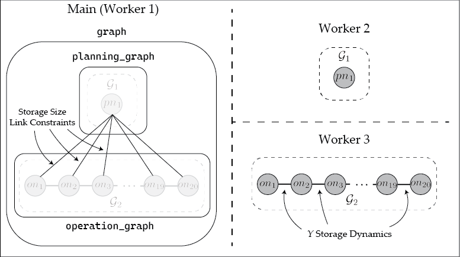

# Storage Sizing Example

This tutorial reproduces a sizing and inventory optimization problem used [here](https://arxiv.org/abs/2501.02098) for a process that converts raw material $X$ into product $Y$. Much of the text and code were first used in the first version of [this manuscript](https://arxiv.org/abs/2511.14966). Because product prices fluctuate and production and sales are constrained, the model optimizes the capacity and use of storage to maximize profit over time.

### Mathematical Formulation
The mathematical formulation is given by: 
```math
    \begin{aligned}
        \min &\; \alpha\cdot s_{size} + \sum^T_{t = 1} \left( \beta_t\cdot x^{buy}_t - \gamma_t\cdot y^{sell}_t \right) \\
        &\; y^{stored}_{t+1} - y^{stored}_t = y^{save}_t, t = 1, ..., T-1 \\
        &\; y^{save}_t + y^{sell}_t - \zeta x^{buy}_t = 0, t = 1, ..., T  \\
        &\; 0 \le y^{stored}_t \le s_{size}, t = 1, ..., T  \\
        &\; 0 \le y^{sell}_t \le \overline{d}^{sell}, t = 1, ..., T \\
        &\; \underline{d}^{save} \le y^{save}_t \le \overline{d}^{save}, t = 1, ..., T \\
        &\; y^{stored}_1 = \bar{y}^{stored}
    \end{aligned}
```
where the decision variables are the maximum storage size, $s_{size}$; the amount of raw material purchased, $x^{buy}_t$; the amount of product sent to storage (can be negative for product removal from storage), $y^{save}_t$; the amount of product sold $y^{sell}_t$; and the amount of product in storage, $y^{stored}_t$. $\alpha$ is the cost of building the storage, $\beta_t$ is the cost of buying $X$, $\gamma_t$ is the cost of selling $Y$, and $\zeta$ is a conversion factor from $X$ to $Y$. The parameters $\overline{d}^{sell}$, $\underline{d}^{save}$, and $\overline{d}^{save}$ are upper and lower bounds on their respective variables, while $\overline{y}^{stored}$ is the initial amount in storage. In the formulation, constraints include mass balances on storage and $Y$ and limits on the amount of $Y$ in storage based on $s_{size}$.

### Building the Model

Here, we implement the model as a `RemoteOptiGraph`

This problem is hierarchical in the sense that there is a planning decision ($s_{size}$) that influences the operational decisions ($x^{buy}_t$, $y^{save}_t$, $y^{sell}_t$, and $y^{stored}_t$). In building this problem, we place each hierarchical layer of the problem on a separate `RemoteOptiGraph`. That is, we place the planning variables on one `RemoteOptiGraph` and the operational variables on another. To begin, we first add two additional processes and then ensure necessary Julia packages are loaded on each process in the standard way. 

```julia
using Plasmo, HiGHS, Distributed

addprocs(2) # Uses default multiprocess (single node) parallelism
@everywhere  using Plasmo, HiGHS, Distributed
```

We then set the problem data, and instantiate a new overall `RemoteOptiGraph` called `graph`. Two additional subgraphs are instantiated, one on worker 2 for the planning problem and the other on worker 3 for the operations problem. These graphs are then added as subgraphs to `graph`.

```julia
# Set Problem data
T = 20
gamma = fill(5, T); beta = fill(20, T); alpha = 10; zeta = 2
gamma[8:10] .= 20; gamma[16:20] .= 50; d_sell = 50; d_save = 20; d_buy = 15; y_bar = 10 
            
# Instantiate remote graphs
graph = RemoteOptiGraph(worker = 1) 
planning_graph = RemoteOptiGraph(worker = 2)
operation_graph = RemoteOptiGraph(worker = 3)
add_subgraph(graph, planning_graph); add_subgraph(graph, operation_graph)
```

The planning problem is then constructed using Plasmo.jl syntax.
```julia
# Define planning node data which includes storage size
@optinode(planning_graph, planning_node)
@variable(planning_node, storage_size >= 0)
@objective(planning_node, Min, storage_size * alpha)
```

This is then followed by the construction of the operational problem.
```julia
# Define operation nodes, loop through and set variables, constraint, and objective
@optinode(operation_graph, operation_nodes[1:T])

for (j, node) in enumerate(operation_nodes)
    @variable(node, 0 <= y_stored)
    @variable(node, 0 <= y_sell <= d_sell)
    @variable(node, -d_save <= y_save <= d_save)
    @variable(node, 0 <= x_buy <= d_buy)
    @constraint(node, y_save + y_sell - zeta * x_buy == 0)
    @objective(node, Min, x_buy * beta[j] - y_sell * gamma[j])
end

# Set initial storage level
@constraint(operation_nodes[1], operation_nodes[1][:y_stored] == y_bar)

# Set mass balance on storage unit
@linkconstraint(operation_graph, [i = 1:(T - 1)], operation_nodes[i + 1][:y_stored] - operation_nodes[i][:y_stored] == operation_nodes[i + 1][:y_save])
```

Linking constraints are then added between the planning and operations level. These are implicitly `InterWorkerEdge`s since they connect across `RemoteOptiGraph`s.

```julia
# Link planning decision to operations decisions
@linkconstraint(graph, [i = 1:T], operation_nodes[i][:y_stored] <= planning_node[:storage_size])
```

Finally, an optimizer can be set on the operations and planning level graphs
```julia
# Set graph objective
set_to_node_objectives(planning_graph); set_to_node_objectives(operation_graph)
set_optimizer(planning_graph, HiGHS.Optimizer)
set_optimizer(operation_graph, HiGHS.Optimizer)
```

The resulting `RemoteOptiGraph` is visualized below. Here, the object `graph` is stored on the main worker (where its corresponding `OptiGraph` appears empty as it only contains subgraphs). The two remote subgraphs `planning_graph` and `operation_graph` objects each reference an `OptiGraph` stored on workers 2 and 3, respectively. The `InterWorkerEdge`s in `graph` on the main worker contain the storage size linking constraints, while the storage dynamics linking constraints are contained in `operation_graph` and stored on worker 3. 



### Solving the RemoteOptiGraph

The RemoteOptiGraphs are not designed to be solved as a monolithic problem. In other words, unlike a Plasmo `OptiGraph`, calling `optimize!(graph)` for the above problem will not solve the storage problem above. Instead, the `RemoteOptiGraph` can instead be used for developing algorithms. For example, `graph` can be solved using Benders decomposition, where the storage sizing variables are the master problem and the `operation_graph` is the subproblem. The accompanying package, [PlasmoBenders.jl](https://github.com/plasmo-dev/PlasmoAlgorithms.jl/tree/main/lib/PlasmoBenders) allows users to directly solve a graph defined in Plasmo using Benders decomposition. For instance, the user can call the following code to apply Benders decomposition to solve `graph`. 

```julia
using PlasmoBenders

benders_alg = BendersAlgorithm(
    graph, # Overall graph
    planning_graph; # "root" graph
    # additional keyword arguments if desired
    add_slacks = true # add slacks to ensure recourse
)

run_algorithm!(benders_alg)
```
