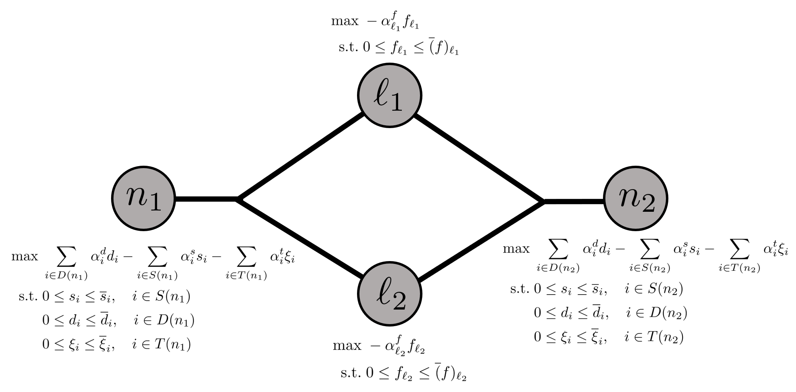

# Supply Chain Optimization

This tutorial shows how to model a supply chain using Plasmo.jl. This problem has a natural graph representation which we will follow in constructing the problem. Code for this problem is also available [here](https://github.com/zavalab/JuliaBox/blob/master/CBE_Chapter/Supply_Chain.jl). This example is from the textbook _Introduction to Software for Chemical Engineers_ (3rd edition) in Chapter 22, "Optimization in Chemical and Biological Engineering using Julia."

### Mathematical Formulation

The supply chain being modeled includes a set of suppliers and consumers, where the suppliers ship products to technologies (for product conversion) or directly to the consumers. Suppliers, consumers, and technologies are located at specific locations (represented by nodes) with varying transportation capacity and costs between nodes. This problem includes the following sets: 

 * Products ($P$)
 * Suppliers ($S$)
 * Demands ($D$)
 * Lines for transporting products ($L$)
 * Technologies ($T$)
 * Nodes/Locations ($N$)

Each supplier and consumer only sells or consumes a single product. In addition $L$ connects two nodes in $N$ and has an associated direction (i.e., this is a directed graph). As each supplier, consumer, and technology are located at a specific node, we will denote these objects at a given node $n \in N$ by $S(n)$, $D(n)$, and $T(n)$, and we will denote the set of all lines originating at node $n$ as $L_{in}(n)$ and the set of all lines ending at at node $n$ as $L_{out}(n)$. We will also add superscripts to these sets for specific products when applicable (e.g., $D^p(n)$ represents the consumers at node $n \in N$ that consume product $p \in P$). Mathematically, this multi-product supply chain problem is given by:

```math
\begin{align*} 
    \max &\; \sum_{n \in N} \left( \sum_{i \in D(n)} \alpha^d_i d_i - \sum_{i \in S(n)} \alpha^s_i s_i - \sum_{i \in T(n)} \alpha^t_i \xi_i \right) - \sum_{i \in L} \alpha^f_i f_i\\
    \textrm{s.t.} &\; \sum_{i \in S^p(n)}s_i - \sum_{i \in D^p(n)} d_i + \sum_{i \in L_{in}^p(n)} f_i - \sum_{i \in L_{out}^p(n)} f_i + \sum_{i \in T(n)} \gamma_{i, p} \xi_i = 0 \quad n \in N, p \in P\\
    &\; 0 \le s_i \le \overline{s}_i, \quad i \in S(n),  n \in N \\
    &\; 0 \le d_i \le \overline{d}_i, \quad i \in D(n), n \in N \\
    &\; 0 \le \xi_i \le \overline{\xi}_i, \quad i \in T(n), n \in N \\
    &\; 0 \le f_i \le \overline{f}_i, \quad i \in L
\end{align*}
```

Here, $s_i$ is the amount of product supplied by supplier $i$, $d_i$ is the amount of product purchased by consumer $i$, $\xi_i$ is the amount of product used to produce a new product by technology $i$, and $f_i$ is the amount of product transported by line $i \in L$. Since each supplier, consumer, and line only handle a single product, these variables do not include the product notation. The technologies consume certain products to produce other products, and the ratio of consumption to generation is captured by the parameter $\gamma_{i,p}, i \in T, p \in P$, where $\gamma_{i, p}$ is negative if product $p$ is consumed by technology $i$, positive if product $p$ is produced by technology $i$, and $0$ otherwise. $\alpha^d_i$ is the price paid by consumer $i$ for each unit of product, $\alpha^s_i$ is the cost for supplier $i$ to supply each unit of product, $\alpha^t_i$ is the cost to operate technology $i$ to consume one unit of product, and $\alpha^f_i$ is the cost to ship one unit of product on line $i$. The parameters $\overline{s}_i$, $\overline{d}_i$, $\overline{\xi}_i$, and $\overline{f}_i$ are the upper bounds on their respective variables. 

The objective function seeks to maximize profit by providing product to consumers while being penalized for the costs from supply, technology, and transport. Each node includes a balance on each product (defined by the first constraint) which requires that the units of product supplied, produced, transported, or consumed (by consumers or by technologies) at each node must be equal to zero. 

### Defining the Data

The data for the supply chain is given below. Here, we have two nodes, $n_1$ and $n_2$, with two suppliers, one consumer, and two technologies located at $n_1$ and two other consumers located at node $n_2$. There are three different products, $p_1$, $p_2$, and $p_3$, and each supplier only produces $p_1$. One technology can produce $p_2$ and the other can produce $p_3$. There are two lines between the nodes; one transfers $p_2$ and the other transfers $p_3$. 

First, we define the sets in Julia:
```julia
# Data sets
N = ["n1", "n2"]; P = ["p1", "p2", "p3"];
S = ["s1(p1)", "s2(p1)"]; D = ["n1(p2)", "n2(p2)", "n2(p3)"];
L = ["n1->n2(p2)", "n1->n2(p3)"]; T = ["p1-p2", "p1-p3"];
```
We next define data for the suppliers, including mapping each node to a set of suppliers and mapping each supplier to a product, upper bound, and cost of supply. 
```julia
# Map nodes to supplies
sloc = Dict("n1" => [S[1], S[2]], "n2" => [])

# Map supplies to products they supply
sprod = ["p1","p1"]; sprod = Dict(zip(S,sprod));

# Define upper bounds on supplies
sub = [1000,500]; sub = Dict(zip(S,sub)); # unit

# Define cost of supplying one unit of a supply's product
sbid = [3,2.5]; sbid = Dict(zip(S, sbid)); # $/unit
```
Next, we define the consumers and similarly map each node to a set of consumers and map each consumer to a product, upper bound, and price for the products. 
```julia
# Map nodes to demands
dloc = Dict("n1" => [D[1]], "n2" => [D[2], D[3]])

# Map demands to the products they require
dprod = ["p2","p2","p3"]; dprod = Dict(zip(D,dprod));

# Define upper bounds on demands
dub = [100,200,500]; dub = Dict(zip(D,dub)); # unit

# Define price for one unit of the demand's product
dbid = [300,300,15]; dbid = Dict(zip(D,dbid)) # $/unit
```
Next, we define the set of technologies, again mapping the nodes to a set of technologies and mapping the technologies to upper bounds on production and the cost of conversion. We also define the $\gamma$ variable which contains the conversion rates for the products. 
```julia
# Map nodes to technologies
ξloc = Dict("n1" => [T[1], T[2]], "n2" => [])

# Define upper bounds on technology conversions
ξub = [1000,1000]; ξub = Dict(zip(T,ξub)); # unit

# Define cost of converting one unit of product
ξbid = [1,0.5]; ξbid = Dict(zip(T,ξbid)); # $/unit

# Product conversion matrices; rows are technologies, columns are products
γ = [-1.0 0.9 0.0;
     -1.0 0.0 0.3]
γ = Dict((T[i], P[j]) => γ[i, j] for j in eachindex(P), i in eachindex(T));
```
Finally, we define data for the transportation lines. Here, `flocs` is a mapping of the source node and `flocr` is a mapping of the destination nodes for each line. Finally, we set upper bounds on each line, define the products the lines can transport, and define the cost of transportation. 
```julia
# Map transport data (flocs = supplying node; flocr = receiving node)
flocs = ["n1","n1"]; flocs = Dict(zip(L,flocs));
flocr = ["n2","n2"]; flocr = Dict(zip(L,flocr));

# Define upper bounds on transport
fub = [1000,1000]; fub = Dict(zip(L,fub)); # unit

# Map transport flows to the product they support
fprod = [["p2"], ["p3"]]; fprod = Dict(zip(L,fprod));

# Define cost of transporting a unit of product
fbid = [0.1,0.1]; fbid = Dict(zip(L,fbid)); # $/unit
```

### Modeling in Plasmo.jl
With the data defined, we can now model the supply chain with Plasmo. Because variables must be placed on nodes, we will create OptiNodes for each node in $N$ and for each line in $L$. We first load in the required packages, instantiate the OptiGraph, and define OptiNodes:

```julia
using Plasmo, HiGHS
graph = OptiGraph()

@optinode(graph, nodes[N])
@optinode(graph, transport[L])
```

Next, we loop through the set of nodes, $N$, and add variables for the suppliers ($s_i$), consumers ($d_i$), and technology production ($\xi_i$). We then define upper bounds on the variables and we define expressions that sum the supplies, demands, and technologies on each node. We next define expressions for the costs and finally set the objective on the node, which is maximizing a summation of the profit from selling a product minus the cost of supply and the cost of technology conversion.

```julia
for n in N
    # Define variables based on above mappings
    @variable(nodes[n], s[sloc[n]]>=0)
    @variable(nodes[n], d[dloc[n]]>=0)
    @variable(nodes[n], ξ[ξloc[n]]>=0)

    # Define upper bounds on variables
    @constraint(nodes[n], [i in sloc[n]], s[i] <= sub[i])
    @constraint(nodes[n], [j in dloc[n]], d[j] <= dub[j])
    @constraint(nodes[n], [t in ξloc[n]], ξ[t] <= ξub[t])

    # Define expressions for summing supplies, demands, techs on a node
    @expression(nodes[n], sum_supplies[p in P],
        sum(s[i] for i in sloc[n] if sprod[i] == p)
    )
    @expression(nodes[n], sum_demands[p in P],
        sum(d[j] for j in dloc[n] if dprod[j] == p)
    )
    @expression(nodes[n], sum_techs[p in P], sum(ξ[t] * γ[t, p] for t in ξloc[n]))

    # Define cost expressions for a node
    scost = @expression(nodes[n], sum(sbid[i] * s[i] for i in sloc[n]))
    dcost = @expression(nodes[n], sum(dbid[j] * d[j] for j in dloc[n]))
    ξcost = @expression(nodes[n], sum(ξbid[t] * ξ[t] for t in ξloc[n]))

    # Set objective on each node
    @objective(nodes[n], Max, dcost - scost - ξcost)
end
```
Next, we similarly loop through the set of lines, $L$, and define a variable for the flow of product ($f_i$). We then set the upper bound and define an expression for the flow in and out for the line for each product (this is to simplify the product mass balances later). We also set an objective on these nodes. 
```julia
# Define variables/constraints/objectives for transport nodes
for l in L
    # Define flow variable
    @variable(transport[l], f[fprod[l]] >= 0)

    # Set upper bound on flow variable
    @constraint(transport[l], [j in fprod[l]], f[j] <= fub[l])

    # Define flow in and out of nodes
    @expression(transport[l], flow_in[p in P, n in N],
        sum(f[i] for i in fprod[l] if flocr[l] == n && i == p)
    )
    @expression(transport[l], flow_out[p in P, n in N],
        sum(f[i] for i in fprod[l] if flocs[l] == n && i == p)
    )

    # Set objective (penalizing transport costs)
    @objective(transport[l], Max, - sum(fbid[l] * f[j] for j in fprod[l]))
end
```
With the nodes defined, we can now set the linking constraints for each product. Here, we define a node balance for each product, where, for each product, we have a mass balance (supply - consumption - flow out + flow in - technology consumption). 

```julia
# For each node, do a product balance for each product
for n in N
    for p in P
        # Node balance must be equal to zero
        node_balance = (nodes[n][:sum_supplies][p] - nodes[n][:sum_demands][p] +
            nodes[n][:sum_techs][p] + sum(transport[l][:flow_in][p, n] for l in L) -
            sum(transport[l][:flow_out][p, n] for l in L)
        )
        if node_balance != 0
            @linkconstraint(graph, node_balance == 0)
        end
    end
end
```
The form of this graph network is visualized below, where the (hyper)edges contain the flow constraints defined above: 



Finally, we set the optimizer on the graph and the overall objective on the graph. 

!!! note
    After the changes made between Plasmo v0.5.4 and v0.6.0, we must now include the function `set_to_node_objectives(graph)` in the script below to set the graph's objective to use the individual node objectives. In former versions of Plasmo, the graph used the node objectives automatically. 

```julia
set_optimizer(graph, HiGHS.Optimizer)
set_to_node_objectives(graph)
```
Finally, we can call `optimize!` and then query the solutions on each node. 
```julia
optimize!(graph)
println(objective_value(graph))
println("Node 1 demand solutions = ", value.(graph[:nodes]["n1"][:d]))
println("Node 2 demand solutions = ", value.(graph[:nodes]["n2"][:d]))
println("Technology conversion = ", value.(graph[:nodes]["n1"][:ξ]))
```