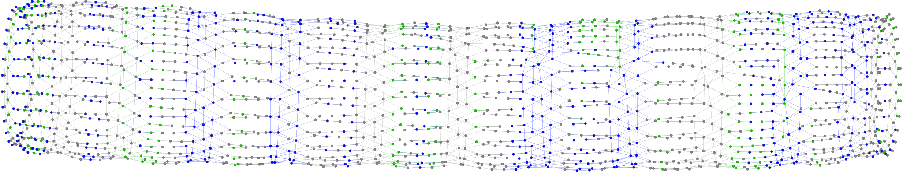

# Tutorial
Here we tutorials that cover more detailed aspects of Plasmo.jl and show how it can be used to create and solve complex optimization problems.

## Optimal Control of a Natural Gas Network
This tutorial shows how to model a natural-gas network optimal control problem by constructing a hierarchical optigraph.  
We show the resulting structure of the optimization problem and demonstrate how to use Plasmo.jl to decompose the problem and use the [PipsSolver](@ref) to distribute and solve the problem
in parallel. The details of this model and a description of its parameters can be found in [this manuscript](https://www.sciencedirect.com/science/article/abs/pii/S0098135418312687).
The actual implementation of this tutorial can be found in [this git repository](https://github.com/zavalab/JuliaBox/tree/master/PlasmoExamples/case_studies/gasnetwork).

### Problem Description
We consider the system of connected pipelines in series shown in the below figure. This linear network includes a gas supply at one end, a time-varying demand at the other end, and twelve compressor stations.
The gas junctions connect thirteen pipelines which forms an optigraph with a linear topology.


We seek to solve an optimal control problem that maximizes revenue over a 24 hour time period given a forecast of gas demand profiles. That is, we wish to obtain a compressor
control policy that will meet the gas demand at junction ``j_{25}``, whilst simultaneously minimizing compressor costs and meeting operational constraints.
In the formulation below, ``\alpha_{\ell}`` and ``P_{\ell,t}`` are the compression cost (\$/kW), and compression power for each compressor ``\ell`` at time ``t``, and ``\alpha_{d}`` and ``f^{target}_{d,t}`` are the demand price and target demand flow for each demand ``d`` at time ``t``. This formulation includes physical equations and constraints that describe the network junctions, the pipeline dynamics, and compressors.  
The network link equations describe how the devices within the topology are coupled together such as conservation of mass and boundary conditions.
The sets that describe the elements of the optimization problem are also presented here.

```math
\begin{aligned}
    \min_{ \substack{ \{ \eta_{\ell,t},f_{j,d,t} \} \\ \ell \in \mathcal{L}_c, d \in \mathcal{D}_j, j \in \mathcal{J}, t \in \mathcal{T}}} \quad &
    \sum_{\substack{\ell \in \mathcal{L}_c \\ t \in \mathcal{T}}} \alpha_{\ell} P_{\ell,t} -
    \sum_{\substack{d \in \mathcal{D}_j, j \in \mathcal{J}, \\  t \in \mathcal{T}}} \alpha_{j,d} f_{j,d,t} &\\
     s.t. \quad & \text{Junction Limits} &  \\
     & \text{Pipeline Dynamics}  &  \\
     & \text{Compressor Equations} &  \\
     & \text{Network Link Equations} &
\end{aligned}
```

#### Sets used for optimization problem

| Set | Description |      Elements |
|--------|-------------|------------|
| ``\mathcal{J}``   |     Set of gas network nodes       |      ``j \in \mathcal{J}`` |
| ``\mathcal{S}``   |     Set of gas supplies      | ``s \in \mathcal{S}`` |
| ``\mathcal{D}``   |     Set of gas demands      |  ``d \in \mathcal{D}`` |
| ``\mathcal{D}_j``   |   Set of gas demands on junction ``j``       | ``d \in \mathcal{D}_j`` |
| ``\mathcal{S}_j``   |   Set of gas supplies on junction ``j``    | ``s \in \mathcal{S}_j`` |
| ``\mathcal{L}``     |   Set of gas network links   | ``\ell \in \mathcal{L}`` |
| ``\mathcal{L}_p``   |   Set of network pipeline links | ``\mathcal{L}_p \subseteq \mathcal{L}`` |
| ``\mathcal{L}_c``   |   Set of network compressor links  | ``\mathcal{L}_c \subseteq \mathcal{L}`` |
| ``\mathcal{X}``   |     Set of spatial discretization points    | ``k \in \mathcal{X}`` |
| ``\mathcal{T}``   |     Set of temporal discretization points  | ``t \in \mathcal{T}`` |

The following sections describe each component of the network in further detail.

### Junction OptiGraph
The gas junctions in a gas network describe the connection points between pipelines and compressors.  The junction model is described by the below equations, where ``\theta_{j,t}`` is the pressure at junction
``j`` and time ``t``. ``\underline{\theta}_j`` is the lower pressure bound for the junction, ``\overline{\theta}_j`` is the upper pressure bound, ``f_{j,d,t}^{target}`` is the target demand flow for demand ``d`` on junction ``j``
and ``\overline{f}_{j,s}`` is the available gas generation from supply ``s`` on junction ``j``.

```math
\begin{aligned}
    & \underline{\theta}_j \le \theta_{j,t} \le \overline{\theta}_j , \quad j \in \mathcal{J}, \ t \in \mathcal{T} \\
    &0 \le f_{j,d,t} \le f_{j,d,t}^{target}, \quad d \in \mathcal{D}_j, \ j \in \mathcal{J}, \ t \in \mathcal{T} \\
    &0 \le f_{j,s,t} \le \overline{f}_{j,s}, \quad s \in \mathcal{S}_j, \ j \in \mathcal{J}, \ t \in \mathcal{T}
\end{aligned}
```

The optigraph that is used to create the junction model is given by the following julia function.  We define the function
`create_junction_model` which accepts junction specific data and the number of time
periods `nt`.  We create the optigraph `graph`, add an optignode for each time interval (using `@optinode`), and then create the variables and constraints for each node in a loop.  We also use the `JuMP` specific
`@expression` macro to refer to expressions for total gas supplied, total gas delivered, and total cost for convenience.  The junction optigraph
is finally returned from the function

```julia
#Define function to create junction model-graph
function create_junction_model(data,nt)            
    graph = OptiGraph()                           

    #Add model-node for each time interval
    @optinode(graph,nodes[1:nt])

    #query number of supply and demands on the junction
    n_demands = length(data[:demand_values])
    n_supplies = length(data[:supplies])

    #Loop and create variables, constraints, and objective for each model-node
    for (i,node) in enumerate(nodes)
        @variable(node, data[:pmin] <= pressure <= data[:pmax], start = 60)
        @variable(node, 0 <= fgen[1:n_supplies] <= 200, start = 10)
        @variable(node, fdeliver[1:n_demands] >= 0)
        @variable(node, fdemand[1:n_demands] >= 0)

        @constraint(node,[d = 1:n_demands],fdeliver[d] <= fdemand[d])

        @expression(node, total_supplied, sum(fgen[s] for s = 1:n_supplies))
        @expression(node, total_delivered,sum(fdeliver[d] for d = 1:n_demands))
        @expression(node, total_delivercost,sum(1000*fdeliver[d] for d = 1:n_demands))

        @objective(node,Min,total_delivercost)
    end                                             

    #Return the junction OptiGraph
    return graph                                   
end
```

### Compressor OptiGraph

Compressors constitute the primary control decisions in the optimal control problem and are described by the following simple
formulation. We use an ideal isentropic compressor model where ``\eta_{\ell,t}``, ``p_{\ell,t}^{in}``, and ``p_{\ell,t}^{out}`` are the compression ratio, suction pressure, and discharge pressure at time ``t``,
and ``P_{\ell,t}`` is power at time ``t``. We also introduceduce the dummy variables ``f_{\ell,t}^{in}`` and ``f_{\ell,t}^{out}`` to be consistent with the
pipeline model in the next section.

```math
\begin{aligned}
    &p_{\ell,t}^{out} = \eta_{\ell,t} p_{\ell,t}^{in}, \quad \ell \in \mathcal{L}_c,\quad t \in \mathcal{T} \\
    &P_{\ell,t} = c_p \cdot T \cdot f_{\ell,t} \left(\left(\frac{p_{\ell,t}^{out}}{p_{\ell,t}^{in}}\right)^{\frac{\gamma-1}{\gamma}}-1\right),
    \quad \ell \in \mathcal{L}_c,\quad t \in \mathcal{T}\\
    &f_{\ell,t} = f_{\ell,t}^{in} = f_{\ell,t}^{out}, \quad \ell \in \mathcal{L}_c,\quad t \in \mathcal{T}
\end{aligned}
```

The compressor optigraph construction is straightforward as shown by the following Julia code.
Like the above model, we define a function called `create_compressor_model` to create a compressor optigraph given `data` and number of time periods `nt`.
We create the compressor optigraph by creating nodes, variables, and constraints, as well as expressions to
refer to flow in and out of each compressor. We lastly return the created optigraph from the function.

```julia
function create_compressor_model(data,nt)                        
    #Create compressor model-graph
    graph = OptiGraph()                                          
    @optinode(graph,nodes[1:nt])

    #Setup variables, constraints, and objective
    for node in nodes
        @variable(node, 1 <= psuction <= 100)
        @variable(node, 1 <= pdischarge <= 100)
        @variable(node, 0 <= power <= 1000)
        @variable(node, flow >= 0)
        @variable(node, 1 <= eta <= 2.5)
        @NLnodeconstraint(node, pdischarge == eta*psuction)
        @NLnodeconstraint(node, power == c4*flow*((pdischarge/psuction)^om-1) )
        @objective(node, Min, cost*power*(dt/3600.0))
    end                                                         

    #Create references for flow in and out
    @expression(graph,fin[t=1:nt],nodes[t][:flow])               
    @expression(graph,fout[t=1:nt],nodes[t][:flow])          

    #Return compressor OptiGraph
    return graph                                              
end
```

### Pipeline OptiGraph
We now implement the pipeline equations to describe the dynamic transport throughout the gas network.
For each pipeline model we assume isothermal flow through horizontal segments with constant pipe friction.  We ultimately produce the
following discretized pipeline model.

```math
\begin{aligned}
    & \frac{p_{\ell,t+1,k} - p_{\ell,t,k}}{\Delta t} = -c_{1,\ell} \frac{f_{\ell,t+1,k+1} - f_{\ell,t+1,k}}{\Delta x_\ell}, \ell \in \mathcal{L}_p,t \in \mathcal{T}, k \in \mathcal{X}_{\ell} \\
    & \frac{f_{\ell,t+1,k} - f_{\ell,t,k}}{\Delta t} = -c_{2,\ell}\frac{p_{\ell,t+1,k+1} - p_{\ell,t+1,k}}{\Delta x_\ell} - c_{3,\ell}\frac{f_{\ell,t+1,k} |f_{\ell,t+1,k}|}{p_{\ell,t+1,k}} \ell \in \mathcal{L}_p, t \in \mathcal{T}, k \in \mathcal{X}_{\ell}  \\
    & f_{\ell,t,N_x} = f_{\ell,t}^{out},\quad \ell \in \mathcal{L}_p, \quad t \in \mathcal{T} \\
    & f_{\ell,t,1} = f_{\ell,t}^{in},\quad \ell \in \mathcal{L}_p, \quad t \in \mathcal{T}    \\
    & p_{\ell,t,N_x} = p_{\ell,t}^{out},\quad \ell \in \mathcal{L}_p, \quad t \in \mathcal{T} \\
    & p_{\ell,t,1} = p_{\ell,t}^{in},\quad \ell \in \mathcal{L}_p, \quad t \in \mathcal{T}    
\end{aligned}
```

The model contains the transport equations defined in terms of pressure and mass flow rate.  It also contains dummy flows and pressures which
represent in the inlet and outlet flow and pressure into each pipeline segment.  We also express a steady-state initial condition which is typical
for this control problem and is given by the following equations.

```math
\begin{aligned}
    & \frac{f_{\ell,1,k+1} - f_{\ell,1,k}}{\Delta x} = 0,  \quad \ell \in \mathcal{L}_{p}, k \in \mathcal{X}_{\ell} \\
    & c_{2,\ell}\frac{p_{\ell,1,k} - p_{\ell,1,k}}{\Delta x} + c_3\frac{f_{\ell,1,k} |f_{\ell,1,k}|}{p_{\ell,1,k}} = 0,
    \quad \ell \in \mathcal{L}_p, k \in \mathcal{X}_{\ell}
\end{aligned}
```

Lastly, we require the total line-pack in each segment (i.e. the inventory of gas) to be refilled at the end of the planning horizon.
This is represented by the following approximation of line-pack and constraint for refilling it.

```math
\begin{aligned}
    & m_{\ell,t} = \frac{A_\ell}{c^2} \sum_{k=1}^{N_{x}} p_{\ell,t,k} \Delta x_{\ell},\quad \ell \in \mathcal{L}_p, t \in \mathcal{T} \\
    & m_{\ell,N_t} \ge m_{\ell,1}, \quad \ell \in \mathcal{L}_p.
\end{aligned}
```

We express the pipeline model with optinodes distributed on a space-time grid.
Specifically, the nodes of each pipeline optigraph form a `nt x nx`  grid
wherein pressure and flow variables are assigned to each node. Flow dynamics within pipelines are then expressed with linking constraints that describe the discretized
PDE equations for mass and momentum using finite differences. We lastly include linking constraints that represent the initial steady-state condition and line-pack constraint.

```julia
function create_pipeline_model(data,nt,nx)                             
    #Unpack data
    c1 = data[:c1]; c2 = data[:c2]; c3 = data[:c3]                     
    dx = data[:pipe_length] / (nx - 1)

    #Create pipeline model-graph
    graph = OptiGraph()

    #Create grid of optinodes
    @node(mg,grid[1:nt,1:nx])                                         

    #Create variables on each node in the grid
    for node in grid
        @variable(node, 1 <= px <= 100)
        @variable(node, 0 <= fx <= 100)
        @variable(node,slack >= 0)
        @NLnodeconstraint(node, slack*px - c3*fx*fx == 0)
    end

    #Setup dummy variable references
    @expression(mg,fin[t=1:nt],grid[:,1][t][:fx])
    @expression(mg,fout[t=1:nt],grid[:,end][t][:fx])
    @expression(mg,pin[t=1:nt],grid[:,1][t][:px])
    @expression(mg,pout[t=1:nt],grid[:,end][t][:px])
    @expression(mg,linepack[t=1:nt],c2/A*sum(grid[t,x][:px]*dx for x in 1:nx-1))          

    #Finite differencing.  Backward difference in time from t, Forward difference in space from x.
    @linkconstraint(mg, press[t=2:nt,x=1:nx-1],                                            
    (grid[t,x][:px]-grid[t-1,x][:px])/dt +
    c1*(grid[t,x+1][:fx] - grid[t,x][:fx])/dx == 0)

    @linkconstraint(mg, flow[t=2:nt,x=1:nx-1],(grid[t,x][:fx] -
    grid[t-1,x][:fx])/dt == -c2*(grid[t,x+1][:px] -
    grid[t,x][:px])/dx - grid[t,x][:slack])

    #Initial steady state
    @linkconstraint(mg,ssflow[x=1:nx-1],grid[1,x+1][:fx] - grid[1,x][:fx] == 0)
    @linkconstraint(mg,sspress[x = 1:nx-1], -c2*(grid[1,x+1][:px] -
    grid[1,x][:px])/dx - grid[1,x][:slack] == 0)

    #Refill pipeline linepack
    @linkconstraint(mg,linepack[end] >= linepack[1])                     
    return graph
end
```

### Network OptiGraph
The network connections define the topology that connect junctions and equipment links (i.e. pipelines and compressors).
Specifically, the network equations express mass conservation around each junction and boundary conditions for pipelines and compressors.
Mass conservation around each junction `j` is given by the following equation.

```math
\begin{aligned}
    & \sum_{\ell\in\mathcal{L}_{rec}(j)} f^{out}_{\ell,t} - \sum_{\ell \in\mathcal{L}_{snd}(j)} f^{in}_{\ell,t} +
    \sum_{s\in\mathcal{S}_j}f_{j,s,t} - \sum_{d\in \mathcal{D}_j}f_{j,d,t} = 0, \quad j \in\mathcal{J}
\end{aligned}
```
where we define ``\mathcal{L}_{rec}(j)`` and ``\mathcal{L}_{snd}(j)`` as the set of receiving and sending links to each junction `j` respectively.

The next equations define pipeline and compressor link boundary conditions.
```math
\begin{aligned}
    & p_{\ell,t}^{in} =  \theta_{rec(\ell),t}, \quad \ell \in \mathcal{L},  t \in \mathcal{T} \\
    & p_{\ell,t}^{out} = \theta_{snd(\ell),t}, \quad \ell \in \mathcal{L},  t \in \mathcal{T}
\end{aligned}
```
Here, ``\theta_{rec(\ell),t}`` and ``\theta_{snd(\ell),t}`` are the receiving and sending junction pressure for each link ``\ell \in \mathcal{L}`` at time ``t``.

The Julia code required to create the network optigraph is a bit more involved, but mostly because we have to define some data structures to capture the network topology.
The below piece of code defines the function `create_gas_network` which accepts a dictionary of network data and calls the above defined functions to create the hierarchical optigraph. That is,
the below code creates junction, compressor, and pipeline optigraphs, adds these optigraphs as subgraphs within a higher level network optigraph, and then creates linking constraints that couple the subgraphs to eachother in the form of mass conservation and boundary conditions.

```julia
function create_gas_network(net_data)              
    pipe_data = net_data[:pipeline_data]
    comp_data = net_data[:comp_data]
    junc_data = net_data[:junc_data]
    pipe_map = net_data[:pipe_map]; comp_map = net_data[:comp_map]

    #Create OptiGraph for entire gas network
    network = OptiGraph()                              
    network[:pipelines] = [];network[:compressors] = [];network[:junctions] = []
    j_map = Dict()

    #Create device OptiGraphs and setup data structures
    for j_data in junc_data                                 
        junc= create_junction_optigraph(j_data)
        add_subgraph!(network,junc); push!(network[:junctions],junc)
        j_map[j_data[:id]] = junc
        junc[:devices_in] = []; junc[:devices_out] = []
    end
    for p_data in pipe_data
        pipe = create_pipeline_optigraph(p_data); push!(network[:pipelines],pipe)
        add_subgraph!(network,pipe);
        pipe[:junc_from] = j_map[p_data[:junc_from]]
        pipe[:junc_to] = j_map[p_data[:junc_to]]
        push!(pipe[:junc_from][:devices_out],pipe); push!(pipe[:junc_to][:devices_in],pipe)
    end
    for c_data in comp_data
        comp = create_compressor_optigraph(c_data)
        add_subgraph!(gas_network,comp); comp[:data] = c_data
        comp[:junc_from] = j_map[c_data[:junc_from]]
        comp[:junc_to] = j_map[c_data[:junc_to]]
        push!(comp[:junc_from][:devices_out],comp); push!(comp[:junc_to][:devices_in],comp)
    end                                                       

    #Link pipelines in gas network
    for pipe in network[:pipelines]                         
        junc_from,junc_to = [pipe[:junc_from],pipe[:junc_to]]
        @linkconstraint(network,[t = 1:nt],pipe[:pin][t] == junc_from[:pressure][t])
        @linkconstraint(gas_network,[t = 1:nt],pipe[:pout][t] == junc_to[:pressure][t])
    end

    #Link compressors in gas network
    for comp in network[:compressors]
        junc_from,junc_to = [comp[:junc_from].comp[:junc_to]]
        @linkconstraint(network,[t = 1:nt],comp[:pin][t] == junc_from[:pressure][t])
        @linkconstraint(network,[t = 1:nt],comp[:pout][t]  == junc_to[:pressure][t])
    end

    #Link junctions in gas network
    for junc in network[:junctions]
        devices_in = junc[:devices_in]; devices_out = junc[:devices_out]

        flow_in = [sum(device[:fout][t] for device in devices_in) for t = 1:nt]
        flow_out = [sum(device[:fin][t] for device in devices_out) for t = 1:nt]

        total_supplied = [junction[:total_supplied][t] for t = 1:nt]
        total_delivered = [junction[:total_delivered][t] for t = 1:nt]

        @linkconstraint(gas_network,[t = 1:nt], flow_in[t] - flow_out[t] +
        total_supplied[t] - total_delivered[t] == 0)
    end                                                 
    return gas_network
end
```

Using the abovie function, we can obtain a complete optigraph representation of the optimal control problem.  It is now possible to plot the graph layout using the functions
in [Plotting](@ref), but we have opted to export the graph structure and use the `Gephi` visualization to produce the below figure.  Here, the green colors correspond to compressor nodes, blue corresponds to junctions, and grey corresponds to pipleines.  Notice that the optigraph has captured the space-time structure of the optimization problem.  We also observe a cylindrical shape to the problem which results from the line-pack constraint which couples the initial and final time optinodes for each pipeline.



### Partitioning
Now that we have an optigraph representation of our optimal control problem, we can use [hypergraph partitioning](https://en.wikipedia.org/wiki/Hypergraph#Partitions)
to decompose the space-time structure. To do so, we use [KaHyPar](https://github.com/kahypar/KaHyPar.jl) and the functions described in [Partitioning and Graph Operations](@ref).
the below code creates a hypergraph representation of the optigraph, sets up node and edge weights, partitions the problem, and forms new subgraphs based on the partitions.  
We also aggregate the subgraphs to produce solvable optinode subproblems which will communicate to our solver.

```julia
#Import the KaHyPar interface
using KaHyPar         

#Get the hypergraph representation of the gas network
hypergraph,ref_map = gethypergraph(gas_network)     

#Setup node and edge weights
n_vertices = length(vertices(hypergraph))              
node_weights = [num_variables(node) for node in all_nodes(gas_network)]
edge_weights = [num_link_constraints(edge) for edge in all_edges(gas_network)]  

#Use KaHyPar to partition the hypergraph
node_vector = KaHyPar.partition(hypergraph,13,configuration = :edge_cut,
imbalance = 0.01, node_weights = node_weights,edge_weights = edge_weights)      

#Create a Partition object
partition = Partition(gas_network,node_vector,ref_map)           

#Setup subgraphs based on the partition
make_subgraphs!(gas_network,partition)             

#Aggregate the subgraphs into OptiNodes which can be solved
new_graph , aggregate_map  = aggregate(gas_network,0)        
```

The partitioned optimal control problem is visualized in the below figure and
depicts the optimization problem partitioned into 13 distinct partitions.


### Solution with PIPS-NLP

We finally solve the partitioned optigraph optimization problem using [PipsNLP](@ref). The below
code snippet distributes the optigraph among 13 worker MPI processes and solves the problem in parallel using the `PIPS-NLP` optimization
solver.
